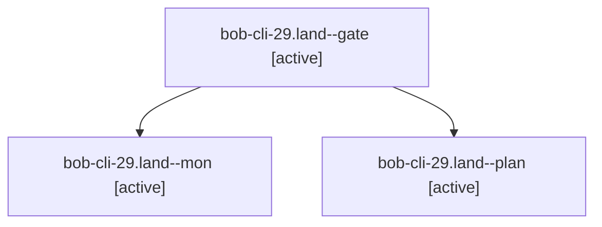

# Session: bob-cli-29.land

[Agent Hoods](../README.md) / [bbugyi200](../users/bbugyi200/README.md) / [apollo](../users/bbugyi200/machines/apollo/README.md) / [bob-cli-29](../users/bbugyi200/machines/apollo/hoods/bob-cli-29/README.md) / bob-cli-29.land

Owner: `bbugyi200.apollo` · Hood: `bob-cli-29` · Members: 3 · Bead: [bob-cli-29](https://github.com/bobs-org/bob-cli--beads/blob/main/pages/bob-cli-29/README.md)

## Lineage

The diagram is an optional enhancement; the ordered table below contains the same lineage in accessible text.

| Role | Agent | State | Model / provider | Timing | Commits | Prompt | Chat |
|---|---|---|---|---|---:|---|---|
| gate | bob-cli-29.land--gate | active | opus / claude | 2026-09-28T13:00:56.742164+00:00 | 0 | — | [Chat](../agents/bbugyi200.apollo.bob-cli-29.land--gate/chat.md) |
| mon | bob-cli-29.land--mon | active | opus / claude | 2026-09-28T13:01:03.075885+00:00 | 0 | — | [Chat](../agents/bbugyi200.apollo.bob-cli-29.land--mon/chat.md) |
| plan | bob-cli-29.land--plan | active | opus / claude | 2026-09-28T12:39:14.076839+00:00 | 0 | [Prompt](../agents/bbugyi200.apollo.bob-cli-29.land--plan/prompt.md) | [Chat](../agents/bbugyi200.apollo.bob-cli-29.land--plan/chat.md) |

## Neighbors

| Agent | Relation | State |
|---|---|---|
| [bob-cli-29.1](../agents/bbugyi200.apollo.bob-cli-29.1/README.md) | bob-cli-29 hood | active |
| [bob-cli-29.2](bbugyi200.apollo.bob-cli-29.2.md) (session · 5) | bob-cli-29 hood | active 5 |
| [bob-cli-29.3](../agents/bbugyi200.apollo.bob-cli-29.3/README.md) | bob-cli-29 hood | active |
| [bob-cli-29.4](../agents/bbugyi200.apollo.bob-cli-29.4/README.md) | bob-cli-29 hood | active |
| [bob-cli-29.5](../agents/bbugyi200.apollo.bob-cli-29.5/README.md) | bob-cli-29 hood | active |
| [bob-cli-29.6.1](../agents/bbugyi200.apollo.bob-cli-29.6.1/README.md) | bob-cli-29 hood | active |
| [bob-cli-29.6.2](../agents/bbugyi200.apollo.bob-cli-29.6.2/README.md) | bob-cli-29 hood | active |
| [bob-cli-29.6.land](../agents/bbugyi200.apollo.bob-cli-29.6.land/README.md) | bob-cli-29 hood | active |
