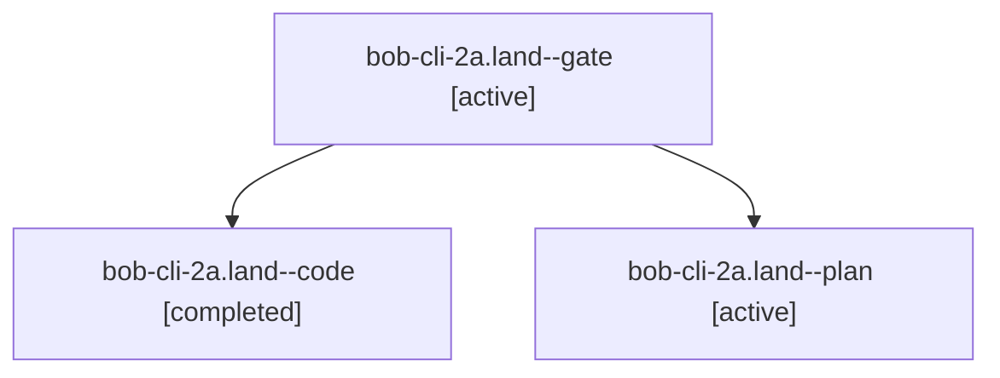

# Session: bob-cli-2a.land

[Agent Hoods](../README.md) / [bbugyi200](../users/bbugyi200/README.md) / [apollo](../users/bbugyi200/machines/apollo/README.md) / [bob-cli-2a](../users/bbugyi200/machines/apollo/hoods/bob-cli-2a/README.md) / bob-cli-2a.land

Owner: `bbugyi200.apollo` · Hood: `bob-cli-2a` · Members: 3 · Bead: [bob-cli-2a](https://github.com/bobs-org/bob-cli--beads/blob/main/pages/bob-cli-2a/README.md)

## Lineage

The diagram is an optional enhancement; the ordered table below contains the same lineage in accessible text.

| Role | Agent | State | Model / provider | Timing | Commits | Prompt | Chat |
|---|---|---|---|---|---:|---|---|
| gate | bob-cli-2a.land--gate | active | grok-4.7 / grok | 2026-09-28T15:59:53.958145+00:00 | 0 | — | [Chat](../agents/bbugyi200.apollo.bob-cli-2a.land--gate/chat.md) |
| code | bob-cli-2a.land--code | completed | muse-spark-1.3-contributor / muse | 2026-09-28T16:00:15.618653+00:00 → 2026-09-28T16:04:43.289921+00:00 | [1](../agents/bbugyi200.apollo.bob-cli-2a.land--code/README.md#commits) | — | [Chat](../agents/bbugyi200.apollo.bob-cli-2a.land--code/chat.md) |
| plan | bob-cli-2a.land--plan | active | grok-4.7 / grok | 2026-09-28T15:44:50.155455+00:00 | 0 | [Prompt](../agents/bbugyi200.apollo.bob-cli-2a.land--plan/prompt.md) | [Chat](../agents/bbugyi200.apollo.bob-cli-2a.land--plan/chat.md) |

## Commits

| Role | Repo | Commit | Subject | Committed |
|---|---|---|---|---|
| code | bob-cli | [`b10b45e`](https://github.com/bobs-org/bob-cli/commit/b10b45ec8eb91e66d2d121d7a10f688bc6fb0954) | docs(capture): fix shift example bare -- to --1 | 2026-09-28 12:03:36 EDT |

## Neighbors

| Agent | Relation | State |
|---|---|---|
| [bob-cli-2a.1](../agents/bbugyi200.apollo.bob-cli-2a.1/README.md) | bob-cli-2a hood | active |
| [bob-cli-2a.2](../agents/bbugyi200.apollo.bob-cli-2a.2/README.md) | bob-cli-2a hood | active |
| [bob-cli-2a.3](../agents/bbugyi200.apollo.bob-cli-2a.3/README.md) | bob-cli-2a hood | active |
