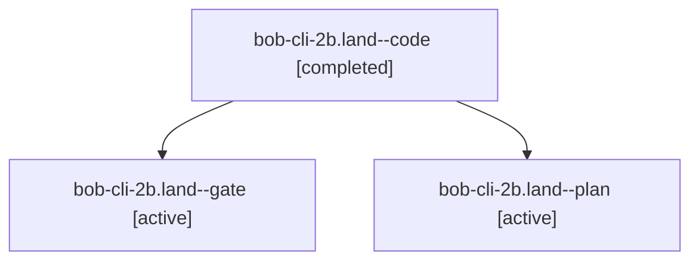

# Session: bob-cli-2b.land

[Agent Hoods](../README.md) / [bbugyi200](../users/bbugyi200/README.md) / [apollo](../users/bbugyi200/machines/apollo/README.md) / [bob-cli-2b](../users/bbugyi200/machines/apollo/hoods/bob-cli-2b/README.md) / bob-cli-2b.land

Owner: `bbugyi200.apollo` · Hood: `bob-cli-2b` · Members: 3 · Bead: [bob-cli-2b](https://github.com/bobs-org/bob-cli--beads/blob/main/pages/bob-cli-2b/README.md)

## Lineage

The diagram is an optional enhancement; the ordered table below contains the same lineage in accessible text.

| Role | Agent | State | Model / provider | Timing | Commits | Prompt | Chat |
|---|---|---|---|---|---:|---|---|
| code | bob-cli-2b.land--code | completed | muse-spark-1.3-contributor / muse | 2026-09-28T16:13:41.237513+00:00 → 2026-09-28T16:31:45.431699+00:00 | [1](../agents/bbugyi200.apollo.bob-cli-2b.land--code/README.md#commits) | — | [Chat](../agents/bbugyi200.apollo.bob-cli-2b.land--code/chat.md) |
| gate | bob-cli-2b.land--gate | active | gpt-6-sol / codex | 2026-09-28T16:13:27.700701+00:00 | 0 | — | [Chat](../agents/bbugyi200.apollo.bob-cli-2b.land--gate/chat.md) |
| plan | bob-cli-2b.land--plan | active | gpt-6-sol / codex | 2026-09-28T16:07:26.813968+00:00 | 0 | [Prompt](../agents/bbugyi200.apollo.bob-cli-2b.land--plan/prompt.md) | [Chat](../agents/bbugyi200.apollo.bob-cli-2b.land--plan/chat.md) |

## Commits

| Role | Repo | Commit | Subject | Committed |
|---|---|---|---|---|
| code | bob-cli | [`8487fe2`](https://github.com/bobs-org/bob-cli/commit/8487fe28dba27ad396b135a87c172b4b54a41a39) | fix(randomize): reject unrepresentable until offsets and priority rolls without wrapping | 2026-09-28 12:30:42 EDT |

## Neighbors

| Agent | Relation | State |
|---|---|---|
| [bob-cli-2b.1](../agents/bbugyi200.apollo.bob-cli-2b.1/README.md) | bob-cli-2b hood | active |
| [bob-cli-2b.2](../agents/bbugyi200.apollo.bob-cli-2b.2/README.md) | bob-cli-2b hood | active |
| [bob-cli-2b.3](../agents/bbugyi200.apollo.bob-cli-2b.3/README.md) | bob-cli-2b hood | active |
| [bob-cli-2b.4](../agents/bbugyi200.apollo.bob-cli-2b.4/README.md) | bob-cli-2b hood | active |
