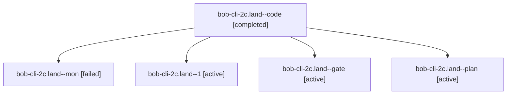

# Session: bob-cli-2c.land

[Agent Hoods](../README.md) / [bbugyi200](../users/bbugyi200/README.md) / [apollo](../users/bbugyi200/machines/apollo/README.md) / [bob-cli-2c](../users/bbugyi200/machines/apollo/hoods/bob-cli-2c/README.md) / bob-cli-2c.land

Owner: `bbugyi200.apollo` · Hood: `bob-cli-2c` · Members: 5 · Bead: [bob-cli-2c](https://github.com/bobs-org/bob-cli--beads/blob/main/pages/bob-cli-2c/README.md)

## Lineage

The diagram is an optional enhancement; the ordered table below contains the same lineage in accessible text.

| Role | Agent | State | Model / provider | Timing | Commits | Prompt | Chat |
|---|---|---|---|---|---:|---|---|
| code | bob-cli-2c.land--code | completed | muse-spark-1.3-contributor / muse | 2026-09-28T18:10:25.706870+00:00 → 2026-09-28T18:12:56.155790+00:00 | 0 | — | [Chat](../agents/bbugyi200.apollo.bob-cli-2c.land--code/chat.md) |
| mon | bob-cli-2c.land--mon | failed | muse-spark-1.3-contributor / muse | 2026-09-28T18:12:28.279565+00:00 → 2026-09-28T18:16:43.078460+00:00 | 0 | — | [Chat](../agents/bbugyi200.apollo.bob-cli-2c.land--mon/chat.md) |
| 1 | bob-cli-2c.land--1 | active | muse-spark-1.3-contributor / muse | 2026-09-28T18:16:42.694622+00:00 | 0 | [Prompt](../agents/bbugyi200.apollo.bob-cli-2c.land--1/prompt.md) | [Chat](../agents/bbugyi200.apollo.bob-cli-2c.land--1/chat.md) |
| gate | bob-cli-2c.land--gate | active | grok-4.7 / grok | 2026-09-28T18:10:09.824350+00:00 | 0 | — | [Chat](../agents/bbugyi200.apollo.bob-cli-2c.land--gate/chat.md) |
| plan | bob-cli-2c.land--plan | active | grok-4.7 / grok | 2026-09-28T17:53:54.877521+00:00 | 0 | [Prompt](../agents/bbugyi200.apollo.bob-cli-2c.land--plan/prompt.md) | [Chat](../agents/bbugyi200.apollo.bob-cli-2c.land--plan/chat.md) |

## Neighbors

| Agent | Relation | State |
|---|---|---|
| [bob-cli-2c.1](../agents/bbugyi200.apollo.bob-cli-2c.1/README.md) | bob-cli-2c hood | active |
| [bob-cli-2c.2](../agents/bbugyi200.apollo.bob-cli-2c.2/README.md) | bob-cli-2c hood | active |
| [bob-cli-2c.3](../agents/bbugyi200.apollo.bob-cli-2c.3/README.md) | bob-cli-2c hood | active |
| [bob-cli-2c.4](../agents/bbugyi200.apollo.bob-cli-2c.4/README.md) | bob-cli-2c hood | active |
