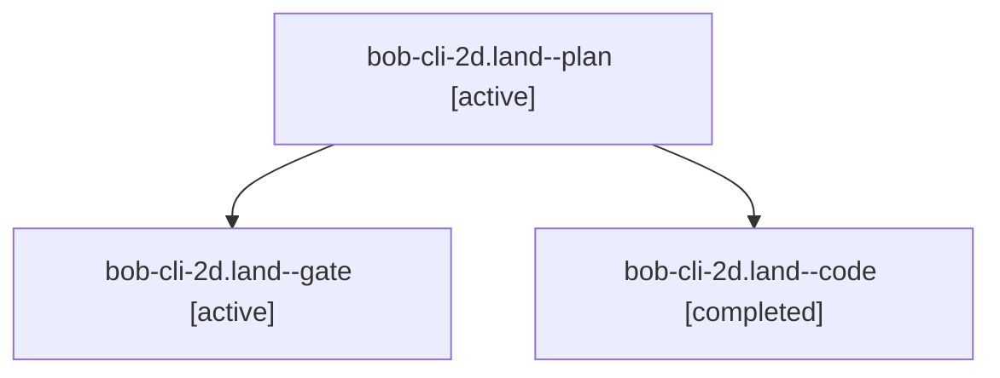

# Session: bob-cli-2d.land

[Agent Hoods](../README.md) / [bbugyi200](../users/bbugyi200/README.md) / [apollo](../users/bbugyi200/machines/apollo/README.md) / [bob-cli-2d](../users/bbugyi200/machines/apollo/hoods/bob-cli-2d/README.md) / bob-cli-2d.land

Owner: `bbugyi200.apollo` · Hood: `bob-cli-2d` · Members: 3 · Bead: [bob-cli-2d](https://github.com/bobs-org/bob-cli--beads/blob/main/pages/bob-cli-2d/README.md)

## Lineage

The diagram is an optional enhancement; the ordered table below contains the same lineage in accessible text.

| Role | Agent | State | Model / provider | Timing | Commits | Prompt | Chat |
|---|---|---|---|---|---:|---|---|
| plan | bob-cli-2d.land--plan | active | opus / claude | 2026-09-28T18:55:10.632632+00:00 | 0 | [Prompt](../agents/bbugyi200.apollo.bob-cli-2d.land--plan/prompt.md) | [Chat](../agents/bbugyi200.apollo.bob-cli-2d.land--plan/chat.md) |
| gate | bob-cli-2d.land--gate | active | opus / claude | 2026-09-28T19:12:21.677256+00:00 | 0 | — | [Chat](../agents/bbugyi200.apollo.bob-cli-2d.land--gate/chat.md) |
| code | bob-cli-2d.land--code | completed | muse-spark-1.3-contributor / muse | 2026-09-28T19:12:35.739081+00:00 → 2026-09-28T19:53:47.411787+00:00 | [1](../agents/bbugyi200.apollo.bob-cli-2d.land--code/README.md#commits) | — | [Chat](../agents/bbugyi200.apollo.bob-cli-2d.land--code/chat.md) |

## Commits

| Role | Repo | Commit | Subject | Committed |
|---|---|---|---|---|
| code | bob-cli | [`d0c1692`](https://github.com/bobs-org/bob-cli/commit/d0c1692c111f2691d35c53a402a38af62591b918) | fix(gkeep): land closeout defects for bob-cli-2d | 2026-09-28 15:53:07 EDT |

## Neighbors

| Agent | Relation | State |
|---|---|---|
| [bob-cli-2d.1](../agents/bbugyi200.apollo.bob-cli-2d.1/README.md) | bob-cli-2d hood | active |
| [bob-cli-2d.2](../agents/bbugyi200.apollo.bob-cli-2d.2/README.md) | bob-cli-2d hood | active |
| [bob-cli-2d.3](../agents/bbugyi200.apollo.bob-cli-2d.3/README.md) | bob-cli-2d hood | active |
| [bob-cli-2d.4](../agents/bbugyi200.apollo.bob-cli-2d.4/README.md) | bob-cli-2d hood | active |
| [bob-cli-2d.5](../agents/bbugyi200.apollo.bob-cli-2d.5/README.md) | bob-cli-2d hood | active |
| [bob-cli-2d.6](../agents/bbugyi200.apollo.bob-cli-2d.6/README.md) | bob-cli-2d hood | active |
| [bob-cli-2d.7](../agents/bbugyi200.apollo.bob-cli-2d.7/README.md) | bob-cli-2d hood | active |
