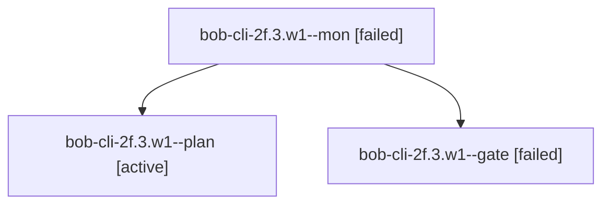

# Session: bob-cli-2f.3.w1

[Agent Hoods](../README.md) / [bbugyi200](../users/bbugyi200/README.md) / [apollo](../users/bbugyi200/machines/apollo/README.md) / [bob-cli-2f](../users/bbugyi200/machines/apollo/hoods/bob-cli-2f/README.md) / bob-cli-2f.3.w1

Owner: `bbugyi200.apollo` · Hood: `bob-cli-2f` · Members: 3

## Lineage

The diagram is an optional enhancement; the ordered table below contains the same lineage in accessible text.

| Role | Agent | State | Model / provider | Timing | Commits | Prompt | Chat |
|---|---|---|---|---|---:|---|---|
| mon | bob-cli-2f.3.w1--mon | failed | opus / claude | 2026-09-28T22:28:05.886923+00:00 → 2026-09-28T22:28:35.030056+00:00 | 0 | — | [Chat](../agents/bbugyi200.apollo.bob-cli-2f.3.w1--mon/chat.md) |
| plan | bob-cli-2f.3.w1--plan | active | opus / claude | 2026-09-28T22:10:10.574413+00:00 | 0 | [Prompt](../agents/bbugyi200.apollo.bob-cli-2f.3.w1--plan/prompt.md) | [Chat](../agents/bbugyi200.apollo.bob-cli-2f.3.w1--plan/chat.md) |
| gate | bob-cli-2f.3.w1--gate | failed | opus / claude | 2026-09-28T22:28:01.113963+00:00 → 2026-09-28T22:28:06.727073+00:00 | 0 | — | [Chat](../agents/bbugyi200.apollo.bob-cli-2f.3.w1--gate/chat.md) |

## Neighbors

| Agent | Relation | State |
|---|---|---|
| [bob-cli-2f.3](bbugyi200.apollo.bob-cli-2f.3.md) (session · 3) | ancestor | active 2, completed 1 |
| [bob-cli-2f.3.w0](../agents/bbugyi200.apollo.bob-cli-2f.3.w0/README.md) | bob-cli-2f.3 hood | active |
| [bob-cli-2f.1](bbugyi200.apollo.bob-cli-2f.1.md) (session · 3) | bob-cli-2f hood | active 2, completed 1 |
| [bob-cli-2f.10](bbugyi200.apollo.bob-cli-2f.10.md) (session · 3) | bob-cli-2f hood | active 2, completed 1 |
| [bob-cli-2f.2](bbugyi200.apollo.bob-cli-2f.2.md) (session · 3) | bob-cli-2f hood | active 2, completed 1 |
| [bob-cli-2f.4](bbugyi200.apollo.bob-cli-2f.4.md) (session · 3) | bob-cli-2f hood | active 2, completed 1 |
| [bob-cli-2f.5](bbugyi200.apollo.bob-cli-2f.5.md) (session · 3) | bob-cli-2f hood | active 2, completed 1 |
| [bob-cli-2f.6](bbugyi200.apollo.bob-cli-2f.6.md) (session · 3) | bob-cli-2f hood | active 2, completed 1 |
| [bob-cli-2f.7](bbugyi200.apollo.bob-cli-2f.7.md) (session · 3) | bob-cli-2f hood | active 2, completed 1 |
| [bob-cli-2f.8](bbugyi200.apollo.bob-cli-2f.8.md) (session · 3) | bob-cli-2f hood | active 2, completed 1 |
| [bob-cli-2f.9](bbugyi200.apollo.bob-cli-2f.9.md) (session · 3) | bob-cli-2f hood | active 2, completed 1 |
| [bob-cli-2f.land](../agents/bbugyi200.apollo.bob-cli-2f.land/README.md) | bob-cli-2f hood | active |
