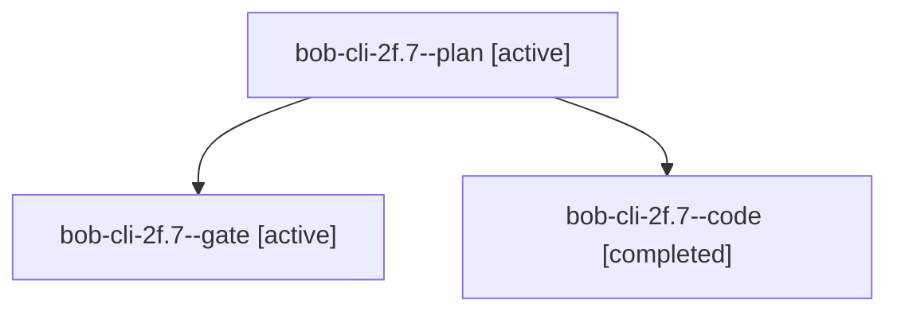

# Session: bob-cli-2f.7

[Agent Hoods](../README.md) / [bbugyi200](../users/bbugyi200/README.md) / [apollo](../users/bbugyi200/machines/apollo/README.md) / [bob-cli-2f](../users/bbugyi200/machines/apollo/hoods/bob-cli-2f/README.md) / bob-cli-2f.7

Owner: `bbugyi200.apollo` · Hood: `bob-cli-2f` · Members: 3 · Bead: [bob-cli-2f.7](https://github.com/bobs-org/bob-cli--beads/blob/main/pages/bob-cli-2f/bob-cli-2f.7.md)

## Lineage

The diagram is an optional enhancement; the ordered table below contains the same lineage in accessible text.

| Role | Agent | State | Model / provider | Timing | Commits | Prompt | Chat |
|---|---|---|---|---|---:|---|---|
| plan | bob-cli-2f.7--plan | active | gpt-6-sol / codex | 2026-09-28T23:34:04.452235+00:00 | 0 | [Prompt](../agents/bbugyi200.apollo.bob-cli-2f.7--plan/prompt.md) | [Chat](../agents/bbugyi200.apollo.bob-cli-2f.7--plan/chat.md) |
| gate | bob-cli-2f.7--gate | active | gpt-6-sol / codex | 2026-09-28T23:37:29.273057+00:00 | 0 | — | [Chat](../agents/bbugyi200.apollo.bob-cli-2f.7--gate/chat.md) |
| code | bob-cli-2f.7--code | completed | muse-spark-1.3-contributor / muse | 2026-09-28T23:37:42.203639+00:00 → 2026-09-28T23:52:23.490458+00:00 | [1](../agents/bbugyi200.apollo.bob-cli-2f.7--code/README.md#commits) | — | [Chat](../agents/bbugyi200.apollo.bob-cli-2f.7--code/chat.md) |

## Commits

| Role | Repo | Commit | Subject | Committed |
|---|---|---|---|---|
| code | bob-cli | [`0abb2bd`](https://github.com/bobs-org/bob-cli/commit/0abb2bd6f45cd587fc0d66f1e1f8af096b751b61) | refactor(projects): split command into directory module under 1500 lines | 2026-09-28 19:51:32 EDT |

## Neighbors

| Agent | Relation | State |
|---|---|---|
| [bob-cli-2f.1](bbugyi200.apollo.bob-cli-2f.1.md) (session · 3) | bob-cli-2f hood | active 2, completed 1 |
| [bob-cli-2f.10](bbugyi200.apollo.bob-cli-2f.10.md) (session · 3) | bob-cli-2f hood | active 2, completed 1 |
| [bob-cli-2f.2](bbugyi200.apollo.bob-cli-2f.2.md) (session · 3) | bob-cli-2f hood | active 2, completed 1 |
| [bob-cli-2f.3](bbugyi200.apollo.bob-cli-2f.3.md) (session · 3) | bob-cli-2f hood | active 2, completed 1 |
| [bob-cli-2f.3.w0](../agents/bbugyi200.apollo.bob-cli-2f.3.w0/README.md) | bob-cli-2f hood | active |
| [bob-cli-2f.3.w1](bbugyi200.apollo.bob-cli-2f.3.w1.md) (session · 3) | bob-cli-2f hood | active 1, failed 2 |
| [bob-cli-2f.4](bbugyi200.apollo.bob-cli-2f.4.md) (session · 3) | bob-cli-2f hood | active 2, completed 1 |
| [bob-cli-2f.5](bbugyi200.apollo.bob-cli-2f.5.md) (session · 3) | bob-cli-2f hood | active 2, completed 1 |
| [bob-cli-2f.6](bbugyi200.apollo.bob-cli-2f.6.md) (session · 3) | bob-cli-2f hood | active 2, completed 1 |
| [bob-cli-2f.8](bbugyi200.apollo.bob-cli-2f.8.md) (session · 3) | bob-cli-2f hood | active 2, completed 1 |
| [bob-cli-2f.9](bbugyi200.apollo.bob-cli-2f.9.md) (session · 3) | bob-cli-2f hood | active 2, completed 1 |
| [bob-cli-2f.land](../agents/bbugyi200.apollo.bob-cli-2f.land/README.md) | bob-cli-2f hood | active |
