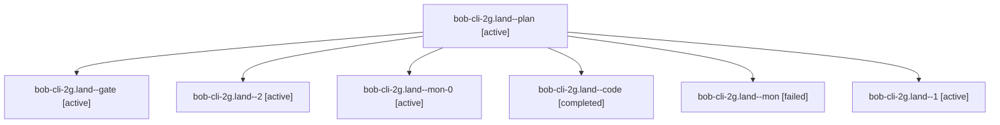

# Session: bob-cli-2g.land

[Agent Hoods](../README.md) / [bbugyi200](../users/bbugyi200/README.md) / [apollo](../users/bbugyi200/machines/apollo/README.md) / [bob-cli-2g](../users/bbugyi200/machines/apollo/hoods/bob-cli-2g/README.md) / bob-cli-2g.land

Owner: `bbugyi200.apollo` · Hood: `bob-cli-2g` · Members: 7 · Bead: [bob-cli-2g](https://github.com/bobs-org/bob-cli--beads/blob/main/pages/bob-cli-2g/README.md)

## Lineage

The diagram is an optional enhancement; the ordered table below contains the same lineage in accessible text.

| Role | Agent | State | Model / provider | Timing | Commits | Prompt | Chat |
|---|---|---|---|---|---:|---|---|
| plan | bob-cli-2g.land--plan | active | gpt-6-sol / codex | 2026-09-28T23:12:18.557555+00:00 | 0 | [Prompt](../agents/bbugyi200.apollo.bob-cli-2g.land--plan/prompt.md) | [Chat](../agents/bbugyi200.apollo.bob-cli-2g.land--plan/chat.md) |
| gate | bob-cli-2g.land--gate | active | gpt-6-sol / codex | 2026-09-28T23:16:59.812381+00:00 | 0 | — | [Chat](../agents/bbugyi200.apollo.bob-cli-2g.land--gate/chat.md) |
| 2 | bob-cli-2g.land--2 | active | muse-spark-1.3-contributor / muse | 2026-09-28T23:27:51.856916+00:00 | 0 | [Prompt](../agents/bbugyi200.apollo.bob-cli-2g.land--2/prompt.md) | [Chat](../agents/bbugyi200.apollo.bob-cli-2g.land--2/chat.md) |
| mon-0 | bob-cli-2g.land--mon-0 | active | muse-spark-1.3-contributor / muse | 2026-09-28T23:23:45.056309+00:00 | 0 | — | [Chat](../agents/bbugyi200.apollo.bob-cli-2g.land--mon-0/chat.md) |
| code | bob-cli-2g.land--code | completed | muse-spark-1.3-contributor / muse | 2026-09-28T23:17:12.461092+00:00 → 2026-09-28T23:22:07.201769+00:00 | 0 | — | [Chat](../agents/bbugyi200.apollo.bob-cli-2g.land--code/chat.md) |
| mon | bob-cli-2g.land--mon | failed | muse-spark-1.3-contributor / muse | 2026-09-28T23:21:39.419550+00:00 → 2026-09-28T23:22:26.464709+00:00 | 0 | — | [Chat](../agents/bbugyi200.apollo.bob-cli-2g.land--mon/chat.md) |
| 1 | bob-cli-2g.land--1 | active | muse-spark-1.3-contributor / muse | 2026-09-28T23:22:26.366703+00:00 | 0 | [Prompt](../agents/bbugyi200.apollo.bob-cli-2g.land--1/prompt.md) | [Chat](../agents/bbugyi200.apollo.bob-cli-2g.land--1/chat.md) |

## Neighbors

| Agent | Relation | State |
|---|---|---|
| [bob-cli-2g.1](../agents/bbugyi200.apollo.bob-cli-2g.1/README.md) | bob-cli-2g hood | active |
| [bob-cli-2g.2](../agents/bbugyi200.apollo.bob-cli-2g.2/README.md) | bob-cli-2g hood | active |
| [bob-cli-2g.3](../agents/bbugyi200.apollo.bob-cli-2g.3/README.md) | bob-cli-2g hood | active |
