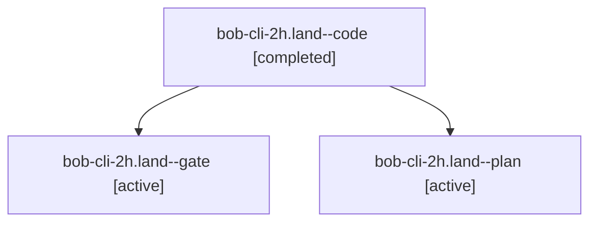

# Session: bob-cli-2h.land

[Agent Hoods](../README.md) / [bbugyi200](../users/bbugyi200/README.md) / [apollo](../users/bbugyi200/machines/apollo/README.md) / [bob-cli-2h](../users/bbugyi200/machines/apollo/hoods/bob-cli-2h/README.md) / bob-cli-2h.land

Owner: `bbugyi200.apollo` · Hood: `bob-cli-2h` · Members: 3 · Bead: [bob-cli-2h](https://github.com/bobs-org/bob-cli--beads/blob/main/pages/bob-cli-2h/README.md)

## Lineage

The diagram is an optional enhancement; the ordered table below contains the same lineage in accessible text.

| Role | Agent | State | Model / provider | Timing | Commits | Prompt | Chat |
|---|---|---|---|---|---:|---|---|
| code | bob-cli-2h.land--code | completed | muse-spark-1.3-contributor / muse | 2026-09-29T15:35:27.203577+00:00 → 2026-09-29T16:30:06.214338+00:00 | [1](../agents/bbugyi200.apollo.bob-cli-2h.land--code/README.md#commits) | — | [Chat](../agents/bbugyi200.apollo.bob-cli-2h.land--code/chat.md) |
| gate | bob-cli-2h.land--gate | active | opus / claude | 2026-09-29T15:35:13.134119+00:00 | 0 | — | [Chat](../agents/bbugyi200.apollo.bob-cli-2h.land--gate/chat.md) |
| plan | bob-cli-2h.land--plan | active | opus / claude | 2026-09-29T15:22:11.245606+00:00 | 0 | [Prompt](../agents/bbugyi200.apollo.bob-cli-2h.land--plan/prompt.md) | [Chat](../agents/bbugyi200.apollo.bob-cli-2h.land--plan/chat.md) |

## Commits

| Role | Repo | Commit | Subject | Committed |
|---|---|---|---|---|
| code | bob-cli | [`ad8616e`](https://github.com/bobs-org/bob-cli/commit/ad8616eca05ff6c9decb91779df8d6f9e6af4174) | fix(capture): report Bob's real block-ID character rule for @route: | 2026-09-29 11:53:01 EDT |

## Neighbors

| Agent | Relation | State |
|---|---|---|
| [bob-cli-2h.1](../agents/bbugyi200.apollo.bob-cli-2h.1/README.md) | bob-cli-2h hood | active |
| [bob-cli-2h.2](../agents/bbugyi200.apollo.bob-cli-2h.2/README.md) | bob-cli-2h hood | active |
| [bob-cli-2h.3](../agents/bbugyi200.apollo.bob-cli-2h.3/README.md) | bob-cli-2h hood | active |
| [bob-cli-2h.4](../agents/bbugyi200.apollo.bob-cli-2h.4/README.md) | bob-cli-2h hood | active |
| [bob-cli-2h.5](../agents/bbugyi200.apollo.bob-cli-2h.5/README.md) | bob-cli-2h hood | active |
