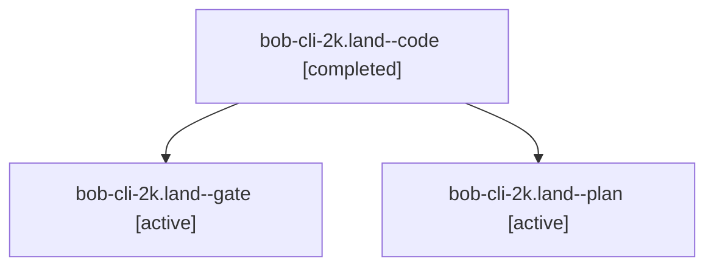

# Session: bob-cli-2k.land

[Agent Hoods](../README.md) / [bbugyi200](../users/bbugyi200/README.md) / [apollo](../users/bbugyi200/machines/apollo/README.md) / [bob-cli-2k](../users/bbugyi200/machines/apollo/hoods/bob-cli-2k/README.md) / bob-cli-2k.land

Owner: `bbugyi200.apollo` · Hood: `bob-cli-2k` · Members: 3 · Bead: [bob-cli-2k](https://github.com/bobs-org/bob-cli--beads/blob/main/pages/bob-cli-2k/README.md)

## Lineage

The diagram is an optional enhancement; the ordered table below contains the same lineage in accessible text.

| Role | Agent | State | Model / provider | Timing | Commits | Prompt | Chat |
|---|---|---|---|---|---:|---|---|
| code | bob-cli-2k.land--code | completed | muse-spark-1.3-contributor / muse | 2026-09-29T19:18:49.092096+00:00 → 2026-09-29T19:48:28.048307+00:00 | [1](../agents/bbugyi200.apollo.bob-cli-2k.land--code/README.md#commits) | — | [Chat](../agents/bbugyi200.apollo.bob-cli-2k.land--code/chat.md) |
| gate | bob-cli-2k.land--gate | active | opus / claude | 2026-09-29T19:18:34.193684+00:00 | 0 | — | [Chat](../agents/bbugyi200.apollo.bob-cli-2k.land--gate/chat.md) |
| plan | bob-cli-2k.land--plan | active | opus / claude | 2026-09-29T19:00:35.120928+00:00 | 0 | [Prompt](../agents/bbugyi200.apollo.bob-cli-2k.land--plan/prompt.md) | [Chat](../agents/bbugyi200.apollo.bob-cli-2k.land--plan/chat.md) |

## Commits

| Role | Repo | Commit | Subject | Committed |
|---|---|---|---|---|
| code | bob-cli | [`afb2e5c`](https://github.com/bobs-org/bob-cli/commit/afb2e5c19174b902f1d34ea6f03bf594e686b8cb) | fix(capture): land epic bob-cli-2k selection follow-ups | 2026-09-29 15:43:59 EDT |

## Neighbors

| Agent | Relation | State |
|---|---|---|
| [bob-cli-2k.1](../agents/bbugyi200.apollo.bob-cli-2k.1/README.md) | bob-cli-2k hood | active |
| [bob-cli-2k.2](../agents/bbugyi200.apollo.bob-cli-2k.2/README.md) | bob-cli-2k hood | active |
| [bob-cli-2k.3](../agents/bbugyi200.apollo.bob-cli-2k.3/README.md) | bob-cli-2k hood | active |
| [bob-cli-2k.4](../agents/bbugyi200.apollo.bob-cli-2k.4/README.md) | bob-cli-2k hood | active |
| [bob-cli-2k.5](../agents/bbugyi200.apollo.bob-cli-2k.5/README.md) | bob-cli-2k hood | active |
