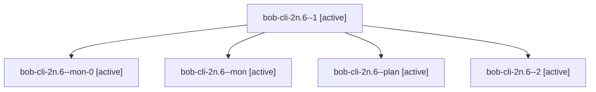

# Session: bob-cli-2n.6

[Agent Hoods](../README.md) / [bbugyi200](../users/bbugyi200/README.md) / [apollo](../users/bbugyi200/machines/apollo/README.md) / [bob-cli-2n](../users/bbugyi200/machines/apollo/hoods/bob-cli-2n/README.md) / bob-cli-2n.6

Owner: `bbugyi200.apollo` · Hood: `bob-cli-2n` · Members: 5 · Bead: [bob-cli-2n.6](https://github.com/bobs-org/bob-cli--beads/blob/main/pages/bob-cli-2n/bob-cli-2n.6.md)

## Lineage

The diagram is an optional enhancement; the ordered table below contains the same lineage in accessible text.

| Role | Agent | State | Model / provider | Timing | Commits | Prompt | Chat |
|---|---|---|---|---|---:|---|---|
| 1 | bob-cli-2n.6--1 | active | muse-spark-1.3-contributor / muse | 2026-09-29T21:36:05.391549+00:00 | 0 | [Prompt](../agents/bbugyi200.apollo.bob-cli-2n.6--1/prompt.md) | [Chat](../agents/bbugyi200.apollo.bob-cli-2n.6--1/chat.md) |
| mon-0 | bob-cli-2n.6--mon-0 | active | muse-spark-1.3-contributor / muse | 2026-09-29T21:36:49.362947+00:00 | 0 | — | [Chat](../agents/bbugyi200.apollo.bob-cli-2n.6--mon-0/chat.md) |
| mon | bob-cli-2n.6--mon | active | muse-spark-1.3-contributor / muse | 2026-09-29T21:35:20.027876+00:00 | 0 | — | [Chat](../agents/bbugyi200.apollo.bob-cli-2n.6--mon/chat.md) |
| plan | bob-cli-2n.6--plan | active | muse-spark-1.3-contributor / muse | 2026-09-29T21:17:27.592087+00:00 | 0 | [Prompt](../agents/bbugyi200.apollo.bob-cli-2n.6--plan/prompt.md) | [Chat](../agents/bbugyi200.apollo.bob-cli-2n.6--plan/chat.md) |
| 2 | bob-cli-2n.6--2 | active | muse-spark-1.3-contributor / muse | 2026-09-29T21:40:07.693036+00:00 | 0 | [Prompt](../agents/bbugyi200.apollo.bob-cli-2n.6--2/prompt.md) | [Chat](../agents/bbugyi200.apollo.bob-cli-2n.6--2/chat.md) |

## Neighbors

| Agent | Relation | State |
|---|---|---|
| [bob-cli-2n.1](../agents/bbugyi200.apollo.bob-cli-2n.1/README.md) | bob-cli-2n hood | active |
| [bob-cli-2n.2](../agents/bbugyi200.apollo.bob-cli-2n.2/README.md) | bob-cli-2n hood | active |
| [bob-cli-2n.3](../agents/bbugyi200.apollo.bob-cli-2n.3/README.md) | bob-cli-2n hood | active |
| [bob-cli-2n.4](../agents/bbugyi200.apollo.bob-cli-2n.4/README.md) | bob-cli-2n hood | active |
| [bob-cli-2n.5](../agents/bbugyi200.apollo.bob-cli-2n.5/README.md) | bob-cli-2n hood | active |
| [bob-cli-2n.land](bbugyi200.apollo.bob-cli-2n.land.md) (session · 3) | bob-cli-2n hood | active 2, completed 1 |
