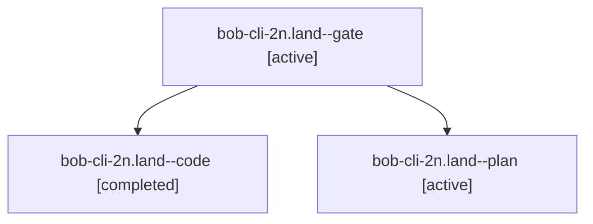

# Session: bob-cli-2n.land

[Agent Hoods](../README.md) / [bbugyi200](../users/bbugyi200/README.md) / [apollo](../users/bbugyi200/machines/apollo/README.md) / [bob-cli-2n](../users/bbugyi200/machines/apollo/hoods/bob-cli-2n/README.md) / bob-cli-2n.land

Owner: `bbugyi200.apollo` · Hood: `bob-cli-2n` · Members: 3 · Bead: [bob-cli-2n](https://github.com/bobs-org/bob-cli--beads/blob/main/pages/bob-cli-2n/README.md)

## Lineage

The diagram is an optional enhancement; the ordered table below contains the same lineage in accessible text.

| Role | Agent | State | Model / provider | Timing | Commits | Prompt | Chat |
|---|---|---|---|---|---:|---|---|
| gate | bob-cli-2n.land--gate | active | opus / claude | 2026-09-29T21:59:48.691953+00:00 | 0 | — | [Chat](../agents/bbugyi200.apollo.bob-cli-2n.land--gate/chat.md) |
| code | bob-cli-2n.land--code | completed | muse-spark-1.3-contributor / muse | 2026-09-29T22:00:03.787297+00:00 → 2026-09-29T22:29:08.164164+00:00 | [1](../agents/bbugyi200.apollo.bob-cli-2n.land--code/README.md#commits) | — | [Chat](../agents/bbugyi200.apollo.bob-cli-2n.land--code/chat.md) |
| plan | bob-cli-2n.land--plan | active | opus / claude | 2026-09-29T21:42:15.866113+00:00 | 0 | [Prompt](../agents/bbugyi200.apollo.bob-cli-2n.land--plan/prompt.md) | [Chat](../agents/bbugyi200.apollo.bob-cli-2n.land--plan/chat.md) |

## Commits

| Role | Repo | Commit | Subject | Committed |
|---|---|---|---|---|
| code | bob-cli | [`d9e85c2`](https://github.com/bobs-org/bob-cli/commit/d9e85c25bdc80cffe309d17b6b6c160ff7dced51) | fix(capture): land epic bob-cli-2n project task links follow-ups | 2026-09-29 18:24:13 EDT |

## Neighbors

| Agent | Relation | State |
|---|---|---|
| [bob-cli-2n.1](../agents/bbugyi200.apollo.bob-cli-2n.1/README.md) | bob-cli-2n hood | active |
| [bob-cli-2n.2](../agents/bbugyi200.apollo.bob-cli-2n.2/README.md) | bob-cli-2n hood | active |
| [bob-cli-2n.3](../agents/bbugyi200.apollo.bob-cli-2n.3/README.md) | bob-cli-2n hood | active |
| [bob-cli-2n.4](../agents/bbugyi200.apollo.bob-cli-2n.4/README.md) | bob-cli-2n hood | active |
| [bob-cli-2n.5](../agents/bbugyi200.apollo.bob-cli-2n.5/README.md) | bob-cli-2n hood | active |
| [bob-cli-2n.6](bbugyi200.apollo.bob-cli-2n.6.md) (session · 5) | bob-cli-2n hood | active 5 |
