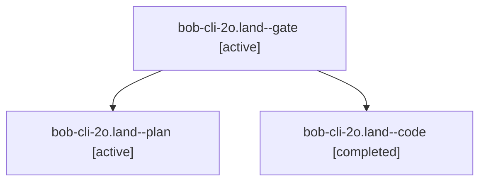

# Session: bob-cli-2o.land

[Agent Hoods](../README.md) / [bbugyi200](../users/bbugyi200/README.md) / [apollo](../users/bbugyi200/machines/apollo/README.md) / [bob-cli-2o](../users/bbugyi200/machines/apollo/hoods/bob-cli-2o/README.md) / bob-cli-2o.land

Owner: `bbugyi200.apollo` · Hood: `bob-cli-2o` · Members: 3 · Bead: [bob-cli-2o](https://github.com/bobs-org/bob-cli--beads/blob/main/pages/bob-cli-2o/README.md)

## Lineage

The diagram is an optional enhancement; the ordered table below contains the same lineage in accessible text.

| Role | Agent | State | Model / provider | Timing | Commits | Prompt | Chat |
|---|---|---|---|---|---:|---|---|
| gate | bob-cli-2o.land--gate | active | opus / claude | 2026-09-30T02:35:42.082951+00:00 | 0 | — | [Chat](../agents/bbugyi200.apollo.bob-cli-2o.land--gate/chat.md) |
| plan | bob-cli-2o.land--plan | active | opus / claude | 2026-09-30T02:04:00.461880+00:00 | 0 | [Prompt](../agents/bbugyi200.apollo.bob-cli-2o.land--plan/prompt.md) | [Chat](../agents/bbugyi200.apollo.bob-cli-2o.land--plan/chat.md) |
| code | bob-cli-2o.land--code | completed | muse-spark-1.3-contributor / muse | 2026-09-30T02:35:55.794347+00:00 → 2026-09-30T03:29:56.793111+00:00 | [1](../agents/bbugyi200.apollo.bob-cli-2o.land--code/README.md#commits) | — | [Chat](../agents/bbugyi200.apollo.bob-cli-2o.land--code/chat.md) |

## Commits

| Role | Repo | Commit | Subject | Committed |
|---|---|---|---|---|
| code | bob-cli | [`25c1b2f`](https://github.com/bobs-org/bob-cli/commit/25c1b2f2cc2f0af4753c7c52442ce4ebfaf4e920) | feat(plan): land bob-cli-2o closeout - config isolation, ledger parity, capture guards, docs | 2026-09-29 23:27:51 EDT |

## Neighbors

| Agent | Relation | State |
|---|---|---|
| [bob-cli-2o.1](../agents/bbugyi200.apollo.bob-cli-2o.1/README.md) | bob-cli-2o hood | active |
| [bob-cli-2o.10](../agents/bbugyi200.apollo.bob-cli-2o.10/README.md) | bob-cli-2o hood | active |
| [bob-cli-2o.11](bbugyi200.apollo.bob-cli-2o.11.md) (session · 7) | bob-cli-2o hood | active 7 |
| [bob-cli-2o.12](../agents/bbugyi200.apollo.bob-cli-2o.12/README.md) | bob-cli-2o hood | active |
| [bob-cli-2o.13](../agents/bbugyi200.apollo.bob-cli-2o.13/README.md) | bob-cli-2o hood | active |
| [bob-cli-2o.2](../agents/bbugyi200.apollo.bob-cli-2o.2/README.md) | bob-cli-2o hood | active |
| [bob-cli-2o.3](../agents/bbugyi200.apollo.bob-cli-2o.3/README.md) | bob-cli-2o hood | active |
| [bob-cli-2o.4](../agents/bbugyi200.apollo.bob-cli-2o.4/README.md) | bob-cli-2o hood | active |
| [bob-cli-2o.5](../agents/bbugyi200.apollo.bob-cli-2o.5/README.md) | bob-cli-2o hood | active |
| [bob-cli-2o.6](../agents/bbugyi200.apollo.bob-cli-2o.6/README.md) | bob-cli-2o hood | active |
| [bob-cli-2o.7](../agents/bbugyi200.apollo.bob-cli-2o.7/README.md) | bob-cli-2o hood | active |
| [bob-cli-2o.8](../agents/bbugyi200.apollo.bob-cli-2o.8/README.md) | bob-cli-2o hood | active |
| [bob-cli-2o.9](bbugyi200.apollo.bob-cli-2o.9.md) (session · 3) | bob-cli-2o hood | active 3 |
