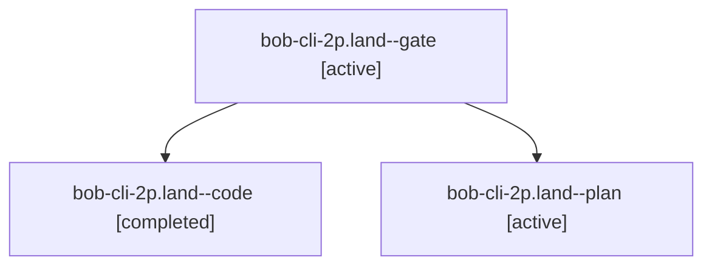

# Session: bob-cli-2p.land

[Agent Hoods](../README.md) / [bbugyi200](../users/bbugyi200/README.md) / [apollo](../users/bbugyi200/machines/apollo/README.md) / [bob-cli-2p](../users/bbugyi200/machines/apollo/hoods/bob-cli-2p/README.md) / bob-cli-2p.land

Owner: `bbugyi200.apollo` · Hood: `bob-cli-2p` · Members: 3 · Bead: [bob-cli-2p](https://github.com/bobs-org/bob-cli--beads/blob/main/pages/bob-cli-2p/README.md)

## Lineage

The diagram is an optional enhancement; the ordered table below contains the same lineage in accessible text.

| Role | Agent | State | Model / provider | Timing | Commits | Prompt | Chat |
|---|---|---|---|---|---:|---|---|
| gate | bob-cli-2p.land--gate | active | opus / claude | 2026-09-30T00:56:31.941589+00:00 | 0 | — | [Chat](../agents/bbugyi200.apollo.bob-cli-2p.land--gate/chat.md) |
| code | bob-cli-2p.land--code | completed | muse-spark-1.3-contributor / muse | 2026-09-30T00:56:48.388910+00:00 → 2026-09-30T01:33:38.214844+00:00 | [1](../agents/bbugyi200.apollo.bob-cli-2p.land--code/README.md#commits) | — | [Chat](../agents/bbugyi200.apollo.bob-cli-2p.land--code/chat.md) |
| plan | bob-cli-2p.land--plan | active | opus / claude | 2026-09-30T00:45:15.139115+00:00 | 0 | [Prompt](../agents/bbugyi200.apollo.bob-cli-2p.land--plan/prompt.md) | [Chat](../agents/bbugyi200.apollo.bob-cli-2p.land--plan/chat.md) |

## Commits

| Role | Repo | Commit | Subject | Committed |
|---|---|---|---|---|
| code | bob-cli | [`090e3eb`](https://github.com/bobs-org/bob-cli/commit/090e3eb49ae8248c6d9e5ac9b2169ccd742a9365) | fix(capture): preview plan budget on again rows, fix named-start help and docs | 2026-09-29 21:32:24 EDT |

## Neighbors

| Agent | Relation | State |
|---|---|---|
| [bob-cli-2p.1](../agents/bbugyi200.apollo.bob-cli-2p.1/README.md) | bob-cli-2p hood | active |
| [bob-cli-2p.2](../agents/bbugyi200.apollo.bob-cli-2p.2/README.md) | bob-cli-2p hood | active |
| [bob-cli-2p.3](../agents/bbugyi200.apollo.bob-cli-2p.3/README.md) | bob-cli-2p hood | active |
| [bob-cli-2p.4](../agents/bbugyi200.apollo.bob-cli-2p.4/README.md) | bob-cli-2p hood | active |
| [bob-cli-2p.5](bbugyi200.apollo.bob-cli-2p.5.md) (session · 3) | bob-cli-2p hood | active 3 |
