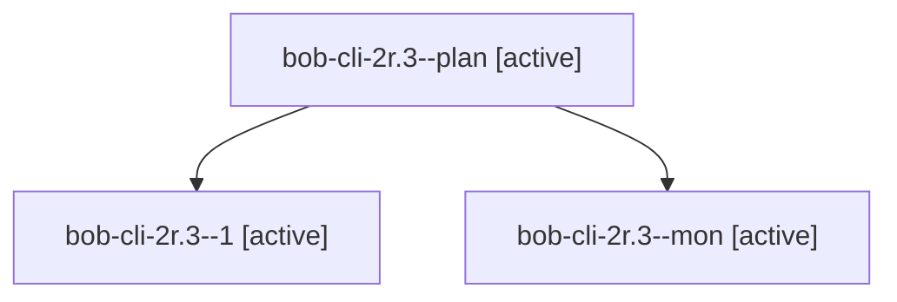

# Session: bob-cli-2r.3

[Agent Hoods](../README.md) / [bbugyi200](../users/bbugyi200/README.md) / [apollo](../users/bbugyi200/machines/apollo/README.md) / [bob-cli-2r](../users/bbugyi200/machines/apollo/hoods/bob-cli-2r/README.md) / bob-cli-2r.3

Owner: `bbugyi200.apollo` · Hood: `bob-cli-2r` · Members: 3 · Bead: [bob-cli-2r.3](https://github.com/bobs-org/bob-cli--beads/blob/main/pages/bob-cli-2r/bob-cli-2r.3.md)

## Lineage

The diagram is an optional enhancement; the ordered table below contains the same lineage in accessible text.

| Role | Agent | State | Model / provider | Timing | Commits | Prompt | Chat |
|---|---|---|---|---|---:|---|---|
| plan | bob-cli-2r.3--plan | active | muse-spark-1.3-contributor / muse | 2026-09-30T12:47:28.628807+00:00 | 0 | [Prompt](../agents/bbugyi200.apollo.bob-cli-2r.3--plan/prompt.md) | [Chat](../agents/bbugyi200.apollo.bob-cli-2r.3--plan/chat.md) |
| 1 | bob-cli-2r.3--1 | active | muse-spark-1.3-contributor / muse | 2026-09-30T13:08:59.275052+00:00 | 0 | [Prompt](../agents/bbugyi200.apollo.bob-cli-2r.3--1/prompt.md) | [Chat](../agents/bbugyi200.apollo.bob-cli-2r.3--1/chat.md) |
| mon | bob-cli-2r.3--mon | active | muse-spark-1.3-contributor / muse | 2026-09-30T13:05:38.386254+00:00 | 0 | — | [Chat](../agents/bbugyi200.apollo.bob-cli-2r.3--mon/chat.md) |

## Neighbors

| Agent | Relation | State |
|---|---|---|
| [bob-cli-2r.1](../agents/bbugyi200.apollo.bob-cli-2r.1/README.md) | bob-cli-2r hood | active |
| [bob-cli-2r.2](../agents/bbugyi200.apollo.bob-cli-2r.2/README.md) | bob-cli-2r hood | active |
| [bob-cli-2r.4](../agents/bbugyi200.apollo.bob-cli-2r.4/README.md) | bob-cli-2r hood | active |
| [bob-cli-2r.land](bbugyi200.apollo.bob-cli-2r.land.md) (session · 3) | bob-cli-2r hood | active 2, completed 1 |
