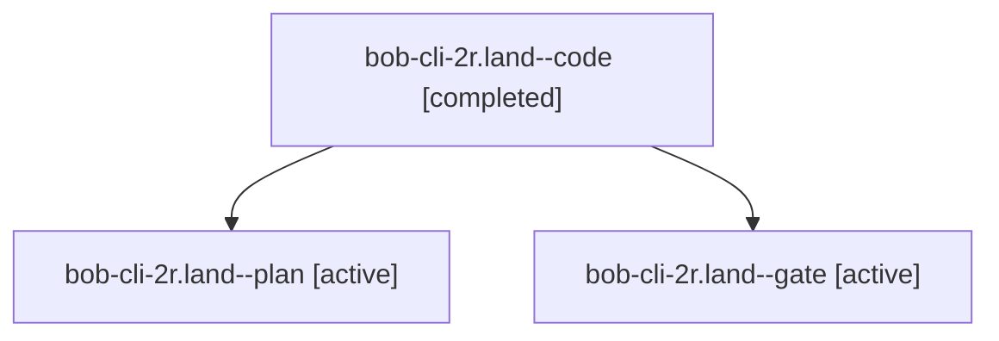

# Session: bob-cli-2r.land

[Agent Hoods](../README.md) / [bbugyi200](../users/bbugyi200/README.md) / [apollo](../users/bbugyi200/machines/apollo/README.md) / [bob-cli-2r](../users/bbugyi200/machines/apollo/hoods/bob-cli-2r/README.md) / bob-cli-2r.land

Owner: `bbugyi200.apollo` · Hood: `bob-cli-2r` · Members: 3 · Bead: [bob-cli-2r](https://github.com/bobs-org/bob-cli--beads/blob/main/pages/bob-cli-2r/README.md)

## Lineage

The diagram is an optional enhancement; the ordered table below contains the same lineage in accessible text.

| Role | Agent | State | Model / provider | Timing | Commits | Prompt | Chat |
|---|---|---|---|---|---:|---|---|
| code | bob-cli-2r.land--code | completed | muse-spark-1.3-contributor / muse | 2026-09-30T14:42:38.454797+00:00 → 2026-09-30T14:59:34.479465+00:00 | [1](../agents/bbugyi200.apollo.bob-cli-2r.land--code/README.md#commits) | — | [Chat](../agents/bbugyi200.apollo.bob-cli-2r.land--code/chat.md) |
| plan | bob-cli-2r.land--plan | active | grok-4.7 / grok | 2026-09-30T14:20:51.593437+00:00 | 0 | [Prompt](../agents/bbugyi200.apollo.bob-cli-2r.land--plan/prompt.md) | [Chat](../agents/bbugyi200.apollo.bob-cli-2r.land--plan/chat.md) |
| gate | bob-cli-2r.land--gate | active | grok-4.7 / grok | 2026-09-30T14:42:22.202632+00:00 | 0 | — | [Chat](../agents/bbugyi200.apollo.bob-cli-2r.land--gate/chat.md) |

## Commits

| Role | Repo | Commit | Subject | Committed |
|---|---|---|---|---|
| code | bob-cli | [`490e452`](https://github.com/bobs-org/bob-cli/commit/490e452eaf94a70b981a8a114758ae324e0ae0e2) | feat(capture): reinstate pomodoro block debug asserts and lock start-drop coverage | 2026-09-30 10:58:20 EDT |

## Neighbors

| Agent | Relation | State |
|---|---|---|
| [bob-cli-2r.1](../agents/bbugyi200.apollo.bob-cli-2r.1/README.md) | bob-cli-2r hood | active |
| [bob-cli-2r.2](../agents/bbugyi200.apollo.bob-cli-2r.2/README.md) | bob-cli-2r hood | active |
| [bob-cli-2r.3](bbugyi200.apollo.bob-cli-2r.3.md) (session · 3) | bob-cli-2r hood | active 3 |
| [bob-cli-2r.4](../agents/bbugyi200.apollo.bob-cli-2r.4/README.md) | bob-cli-2r hood | active |
