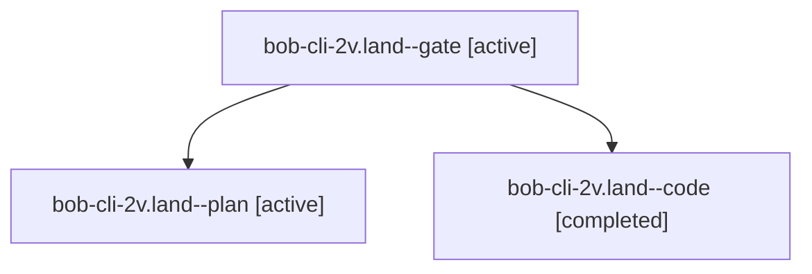

# Session: bob-cli-2v.land

[Agent Hoods](../README.md) / [bbugyi200](../users/bbugyi200/README.md) / [apollo](../users/bbugyi200/machines/apollo/README.md) / [bob-cli-2v](../users/bbugyi200/machines/apollo/hoods/bob-cli-2v/README.md) / bob-cli-2v.land

Owner: `bbugyi200.apollo` · Hood: `bob-cli-2v` · Members: 3 · Bead: [bob-cli-2v](https://github.com/bobs-org/bob-cli--beads/blob/main/pages/bob-cli-2v/README.md)

## Lineage

The diagram is an optional enhancement; the ordered table below contains the same lineage in accessible text.

| Role | Agent | State | Model / provider | Timing | Commits | Prompt | Chat |
|---|---|---|---|---|---:|---|---|
| gate | bob-cli-2v.land--gate | active | opus / claude | 2026-09-30T18:47:13.016926+00:00 | 0 | — | [Chat](../agents/bbugyi200.apollo.bob-cli-2v.land--gate/chat.md) |
| plan | bob-cli-2v.land--plan | active | opus / claude | 2026-09-30T18:28:31.824313+00:00 | 0 | [Prompt](../agents/bbugyi200.apollo.bob-cli-2v.land--plan/prompt.md) | [Chat](../agents/bbugyi200.apollo.bob-cli-2v.land--plan/chat.md) |
| code | bob-cli-2v.land--code | completed | muse-spark-1.3-contributor / muse | 2026-09-30T18:47:28.431877+00:00 → 2026-09-30T19:15:27.674701+00:00 | [1](../agents/bbugyi200.apollo.bob-cli-2v.land--code/README.md#commits) | — | [Chat](../agents/bbugyi200.apollo.bob-cli-2v.land--code/chat.md) |

## Commits

| Role | Repo | Commit | Subject | Committed |
|---|---|---|---|---|
| code | bob-cli | [`8f2a02e`](https://github.com/bobs-org/bob-cli/commit/8f2a02ec31d23d3b70bde8a4dcd7fc751dcc0461) | refactor(capture): move completion doc comment and privatize schedule helper | 2026-09-30 15:14:00 EDT |

## Neighbors

| Agent | Relation | State |
|---|---|---|
| [bob-cli-2v.1](../agents/bbugyi200.apollo.bob-cli-2v.1/README.md) | bob-cli-2v hood | active |
| [bob-cli-2v.2](../agents/bbugyi200.apollo.bob-cli-2v.2/README.md) | bob-cli-2v hood | active |
| [bob-cli-2v.3](bbugyi200.apollo.bob-cli-2v.3.md) (session · 3) | bob-cli-2v hood | active 3 |
| [bob-cli-2v.4](../agents/bbugyi200.apollo.bob-cli-2v.4/README.md) | bob-cli-2v hood | active |
| [bob-cli-2v.5](../agents/bbugyi200.apollo.bob-cli-2v.5/README.md) | bob-cli-2v hood | active |
