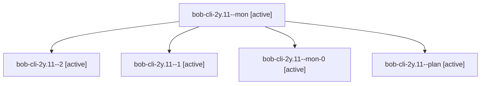

# Session: bob-cli-2y.11

[Agent Hoods](../README.md) / [bbugyi200](../users/bbugyi200/README.md) / [apollo](../users/bbugyi200/machines/apollo/README.md) / [bob-cli-2y](../users/bbugyi200/machines/apollo/hoods/bob-cli-2y/README.md) / bob-cli-2y.11

Owner: `bbugyi200.apollo` · Hood: `bob-cli-2y` · Members: 5 · Bead: [bob-cli-2y.11](https://github.com/bobs-org/bob-cli--beads/blob/main/pages/bob-cli-2y/bob-cli-2y.11.md)

## Lineage

The diagram is an optional enhancement; the ordered table below contains the same lineage in accessible text.

| Role | Agent | State | Model / provider | Timing | Commits | Prompt | Chat |
|---|---|---|---|---|---:|---|---|
| mon | bob-cli-2y.11--mon | active | muse-spark-1.3-contributor / muse | 2026-09-30T22:28:52.691448+00:00 | 0 | — | [Chat](../agents/bbugyi200.apollo.bob-cli-2y.11--mon/chat.md) |
| 2 | bob-cli-2y.11--2 | active | muse-spark-1.3-contributor / muse | 2026-09-30T22:43:24.901144+00:00 | 0 | [Prompt](../agents/bbugyi200.apollo.bob-cli-2y.11--2/prompt.md) | [Chat](../agents/bbugyi200.apollo.bob-cli-2y.11--2/chat.md) |
| 1 | bob-cli-2y.11--1 | active | muse-spark-1.3-contributor / muse | 2026-09-30T22:33:19.760622+00:00 | 0 | [Prompt](../agents/bbugyi200.apollo.bob-cli-2y.11--1/prompt.md) | [Chat](../agents/bbugyi200.apollo.bob-cli-2y.11--1/chat.md) |
| mon-0 | bob-cli-2y.11--mon-0 | active | muse-spark-1.3-contributor / muse | 2026-09-30T22:34:53.850445+00:00 | 0 | — | [Chat](../agents/bbugyi200.apollo.bob-cli-2y.11--mon-0/chat.md) |
| plan | bob-cli-2y.11--plan | active | muse-spark-1.3-contributor / muse | 2026-09-30T22:05:21.799021+00:00 | 0 | [Prompt](../agents/bbugyi200.apollo.bob-cli-2y.11--plan/prompt.md) | [Chat](../agents/bbugyi200.apollo.bob-cli-2y.11--plan/chat.md) |

## Neighbors

| Agent | Relation | State |
|---|---|---|
| [bob-cli-2y.1](../agents/bbugyi200.apollo.bob-cli-2y.1/README.md) | bob-cli-2y hood | active |
| [bob-cli-2y.10](../agents/bbugyi200.apollo.bob-cli-2y.10/README.md) | bob-cli-2y hood | active |
| [bob-cli-2y.12](../agents/bbugyi200.apollo.bob-cli-2y.12/README.md) | bob-cli-2y hood | active |
| [bob-cli-2y.2](../agents/bbugyi200.apollo.bob-cli-2y.2/README.md) | bob-cli-2y hood | active |
| [bob-cli-2y.3](../agents/bbugyi200.apollo.bob-cli-2y.3/README.md) | bob-cli-2y hood | active |
| [bob-cli-2y.4](../agents/bbugyi200.apollo.bob-cli-2y.4/README.md) | bob-cli-2y hood | active |
| [bob-cli-2y.5](../agents/bbugyi200.apollo.bob-cli-2y.5/README.md) | bob-cli-2y hood | active |
| [bob-cli-2y.6](../agents/bbugyi200.apollo.bob-cli-2y.6/README.md) | bob-cli-2y hood | active |
| [bob-cli-2y.7](../agents/bbugyi200.apollo.bob-cli-2y.7/README.md) | bob-cli-2y hood | active |
| [bob-cli-2y.8](../agents/bbugyi200.apollo.bob-cli-2y.8/README.md) | bob-cli-2y hood | active |
| [bob-cli-2y.9](../agents/bbugyi200.apollo.bob-cli-2y.9/README.md) | bob-cli-2y hood | active |
| [bob-cli-2y.land](bbugyi200.apollo.bob-cli-2y.land.md) (session · 3) | bob-cli-2y hood | active 2, completed 1 |
