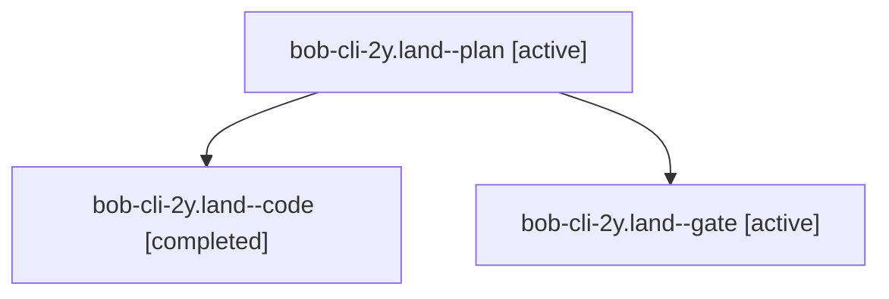

# Session: bob-cli-2y.land

[Agent Hoods](../README.md) / [bbugyi200](../users/bbugyi200/README.md) / [apollo](../users/bbugyi200/machines/apollo/README.md) / [bob-cli-2y](../users/bbugyi200/machines/apollo/hoods/bob-cli-2y/README.md) / bob-cli-2y.land

Owner: `bbugyi200.apollo` · Hood: `bob-cli-2y` · Members: 3 · Bead: [bob-cli-2y](https://github.com/bobs-org/bob-cli--beads/blob/main/pages/bob-cli-2y/README.md)

## Lineage

The diagram is an optional enhancement; the ordered table below contains the same lineage in accessible text.

| Role | Agent | State | Model / provider | Timing | Commits | Prompt | Chat |
|---|---|---|---|---|---:|---|---|
| plan | bob-cli-2y.land--plan | active | opus / claude | 2026-09-30T23:00:39.207298+00:00 | 0 | [Prompt](../agents/bbugyi200.apollo.bob-cli-2y.land--plan/prompt.md) | [Chat](../agents/bbugyi200.apollo.bob-cli-2y.land--plan/chat.md) |
| code | bob-cli-2y.land--code | completed | muse-spark-1.3-contributor / muse | 2026-09-30T23:13:34.345470+00:00 → 2026-09-30T23:25:20.075977+00:00 | [1](../agents/bbugyi200.apollo.bob-cli-2y.land--code/README.md#commits) | — | [Chat](../agents/bbugyi200.apollo.bob-cli-2y.land--code/chat.md) |
| gate | bob-cli-2y.land--gate | active | opus / claude | 2026-09-30T23:13:17.516631+00:00 | 0 | — | [Chat](../agents/bbugyi200.apollo.bob-cli-2y.land--gate/chat.md) |

## Commits

| Role | Repo | Commit | Subject | Committed |
|---|---|---|---|---|
| code | bob-cli | [`af0d17f`](https://github.com/bobs-org/bob-cli/commit/af0d17f211bd7980671a21d2415dc305c9b8e2ed) | chore(hooks): remove In Progress rollback leftovers, fix two stale doc lines (bob-cli-2y) | 2026-09-30 19:23:36 EDT |

## Neighbors

| Agent | Relation | State |
|---|---|---|
| [bob-cli-2y.1](../agents/bbugyi200.apollo.bob-cli-2y.1/README.md) | bob-cli-2y hood | active |
| [bob-cli-2y.10](../agents/bbugyi200.apollo.bob-cli-2y.10/README.md) | bob-cli-2y hood | active |
| [bob-cli-2y.11](bbugyi200.apollo.bob-cli-2y.11.md) (session · 5) | bob-cli-2y hood | active 5 |
| [bob-cli-2y.12](../agents/bbugyi200.apollo.bob-cli-2y.12/README.md) | bob-cli-2y hood | active |
| [bob-cli-2y.2](../agents/bbugyi200.apollo.bob-cli-2y.2/README.md) | bob-cli-2y hood | active |
| [bob-cli-2y.3](../agents/bbugyi200.apollo.bob-cli-2y.3/README.md) | bob-cli-2y hood | active |
| [bob-cli-2y.4](../agents/bbugyi200.apollo.bob-cli-2y.4/README.md) | bob-cli-2y hood | active |
| [bob-cli-2y.5](../agents/bbugyi200.apollo.bob-cli-2y.5/README.md) | bob-cli-2y hood | active |
| [bob-cli-2y.6](../agents/bbugyi200.apollo.bob-cli-2y.6/README.md) | bob-cli-2y hood | active |
| [bob-cli-2y.7](../agents/bbugyi200.apollo.bob-cli-2y.7/README.md) | bob-cli-2y hood | active |
| [bob-cli-2y.8](../agents/bbugyi200.apollo.bob-cli-2y.8/README.md) | bob-cli-2y hood | active |
| [bob-cli-2y.9](../agents/bbugyi200.apollo.bob-cli-2y.9/README.md) | bob-cli-2y hood | active |
