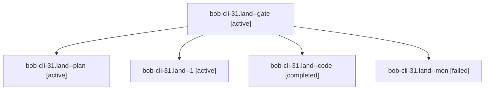

# Session: bob-cli-31.land

[Agent Hoods](../README.md) / [bbugyi200](../users/bbugyi200/README.md) / [apollo](../users/bbugyi200/machines/apollo/README.md) / [bob-cli-31](../users/bbugyi200/machines/apollo/hoods/bob-cli-31/README.md) / bob-cli-31.land

Owner: `bbugyi200.apollo` · Hood: `bob-cli-31` · Members: 5 · Bead: [bob-cli-31](https://github.com/bobs-org/bob-cli--beads/blob/main/pages/bob-cli-31/README.md)

## Lineage

The diagram is an optional enhancement; the ordered table below contains the same lineage in accessible text.

| Role | Agent | State | Model / provider | Timing | Commits | Prompt | Chat |
|---|---|---|---|---|---:|---|---|
| gate | bob-cli-31.land--gate | active | opus / claude | 2026-10-01T03:51:07.851971+00:00 | 0 | — | [Chat](../agents/bbugyi200.apollo.bob-cli-31.land--gate/chat.md) |
| plan | bob-cli-31.land--plan | active | opus / claude | 2026-10-01T03:34:10.691249+00:00 | 0 | [Prompt](../agents/bbugyi200.apollo.bob-cli-31.land--plan/prompt.md) | [Chat](../agents/bbugyi200.apollo.bob-cli-31.land--plan/chat.md) |
| 1 | bob-cli-31.land--1 | active | muse-spark-1.3-contributor / muse | 2026-10-01T04:10:01.600109+00:00 | [1](../agents/bbugyi200.apollo.bob-cli-31.land--1/README.md#commits) | [Prompt](../agents/bbugyi200.apollo.bob-cli-31.land--1/prompt.md) | [Chat](../agents/bbugyi200.apollo.bob-cli-31.land--1/chat.md) |
| code | bob-cli-31.land--code | completed | muse-spark-1.3-contributor / muse | 2026-10-01T03:51:24.874052+00:00 → 2026-10-01T04:09:37.344089+00:00 | 0 | — | [Chat](../agents/bbugyi200.apollo.bob-cli-31.land--code/chat.md) |
| mon | bob-cli-31.land--mon | failed | muse-spark-1.3-contributor / muse | 2026-10-01T04:09:02.743222+00:00 → 2026-10-01T04:10:01.671983+00:00 | 0 | — | [Chat](../agents/bbugyi200.apollo.bob-cli-31.land--mon/chat.md) |

## Commits

| Role | Repo | Commit | Subject | Committed |
|---|---|---|---|---|
| 1 | bob-cli | [`6710c74`](https://github.com/bobs-org/bob-cli/commit/6710c748752969e82504bedbdfcb1956704bc317) | test(freshness): land epic bob-cli-31 — fix linked\_task\_tests stamps, clear epic clippy warnings | 2026-10-01 00:18:31 EDT |

## Neighbors

| Agent | Relation | State |
|---|---|---|
| [bob-cli-31.1](../agents/bbugyi200.apollo.bob-cli-31.1/README.md) | bob-cli-31 hood | active |
| [bob-cli-31.10](../agents/bbugyi200.apollo.bob-cli-31.10/README.md) | bob-cli-31 hood | active |
| [bob-cli-31.2](../agents/bbugyi200.apollo.bob-cli-31.2/README.md) | bob-cli-31 hood | active |
| [bob-cli-31.3](../agents/bbugyi200.apollo.bob-cli-31.3/README.md) | bob-cli-31 hood | active |
| [bob-cli-31.4](../agents/bbugyi200.apollo.bob-cli-31.4/README.md) | bob-cli-31 hood | active |
| [bob-cli-31.5](../agents/bbugyi200.apollo.bob-cli-31.5/README.md) | bob-cli-31 hood | active |
| [bob-cli-31.6](../agents/bbugyi200.apollo.bob-cli-31.6/README.md) | bob-cli-31 hood | active |
| [bob-cli-31.7](../agents/bbugyi200.apollo.bob-cli-31.7/README.md) | bob-cli-31 hood | active |
| [bob-cli-31.8](../agents/bbugyi200.apollo.bob-cli-31.8/README.md) | bob-cli-31 hood | active |
| [bob-cli-31.9](../agents/bbugyi200.apollo.bob-cli-31.9/README.md) | bob-cli-31 hood | active |
