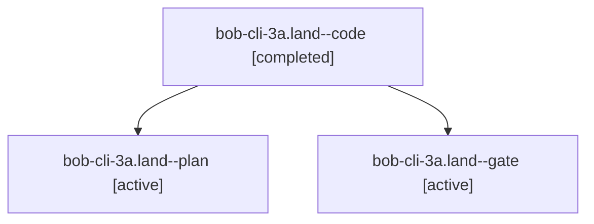

# Session: bob-cli-3a.land

[Agent Hoods](../README.md) / [bbugyi200](../users/bbugyi200/README.md) / [apollo](../users/bbugyi200/machines/apollo/README.md) / [bob-cli-3a](../users/bbugyi200/machines/apollo/hoods/bob-cli-3a/README.md) / bob-cli-3a.land

Owner: `bbugyi200.apollo` · Hood: `bob-cli-3a` · Members: 3 · Bead: [bob-cli-3a](https://github.com/bobs-org/bob-cli--beads/blob/main/pages/bob-cli-3a/README.md)

## Lineage

The diagram is an optional enhancement; the ordered table below contains the same lineage in accessible text.

| Role | Agent | State | Model / provider | Timing | Commits | Prompt | Chat |
|---|---|---|---|---|---:|---|---|
| code | bob-cli-3a.land--code | completed | muse-spark-1.3-contributor / muse | 2026-10-01T16:28:20.595152+00:00 → 2026-10-01T16:33:20.401290+00:00 | 0 | — | [Chat](../agents/bbugyi200.apollo.bob-cli-3a.land--code/chat.md) |
| plan | bob-cli-3a.land--plan | active | grok-4.7 / grok | 2026-10-01T16:13:50.487968+00:00 | 0 | [Prompt](../agents/bbugyi200.apollo.bob-cli-3a.land--plan/prompt.md) | [Chat](../agents/bbugyi200.apollo.bob-cli-3a.land--plan/chat.md) |
| gate | bob-cli-3a.land--gate | active | grok-4.7 / grok | 2026-10-01T16:28:05.219350+00:00 | 0 | — | [Chat](../agents/bbugyi200.apollo.bob-cli-3a.land--gate/chat.md) |

## Neighbors

| Agent | Relation | State |
|---|---|---|
| [bob-cli-3a.1](../agents/bbugyi200.apollo.bob-cli-3a.1/README.md) | bob-cli-3a hood | active |
| [bob-cli-3a.2](../agents/bbugyi200.apollo.bob-cli-3a.2/README.md) | bob-cli-3a hood | active |
| [bob-cli-3a.3](../agents/bbugyi200.apollo.bob-cli-3a.3/README.md) | bob-cli-3a hood | active |
