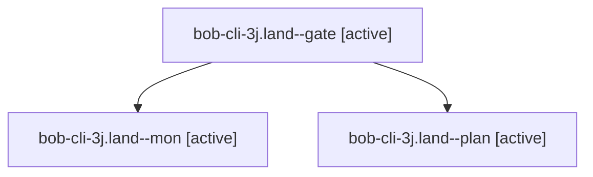

# Session: bob-cli-3j.land

[Agent Hoods](../README.md) / [bbugyi200](../users/bbugyi200/README.md) / [apollo](../users/bbugyi200/machines/apollo/README.md) / [bob-cli-3j](../users/bbugyi200/machines/apollo/hoods/bob-cli-3j/README.md) / bob-cli-3j.land

Owner: `bbugyi200.apollo` · Hood: `bob-cli-3j` · Members: 3 · Bead: [bob-cli-3j](https://github.com/bobs-org/bob-cli--beads/blob/main/pages/bob-cli-3j/README.md)

## Lineage

The diagram is an optional enhancement; the ordered table below contains the same lineage in accessible text.

| Role | Agent | State | Model / provider | Timing | Commits | Prompt | Chat |
|---|---|---|---|---|---:|---|---|
| gate | bob-cli-3j.land--gate | active | opus / claude | 2026-10-02T18:26:10.044024+00:00 | 0 | — | [Chat](../agents/bbugyi200.apollo.bob-cli-3j.land--gate/chat.md) |
| mon | bob-cli-3j.land--mon | active | opus / claude | 2026-10-02T18:26:15.661716+00:00 | 0 | — | [Chat](../agents/bbugyi200.apollo.bob-cli-3j.land--mon/chat.md) |
| plan | bob-cli-3j.land--plan | active | opus / claude | 2026-10-02T18:04:05.341597+00:00 | 0 | [Prompt](../agents/bbugyi200.apollo.bob-cli-3j.land--plan/prompt.md) | [Chat](../agents/bbugyi200.apollo.bob-cli-3j.land--plan/chat.md) |

## Neighbors

| Agent | Relation | State |
|---|---|---|
| [bob-cli-3j.1](../agents/bbugyi200.apollo.bob-cli-3j.1/README.md) | bob-cli-3j hood | active |
| [bob-cli-3j.2](../agents/bbugyi200.apollo.bob-cli-3j.2/README.md) | bob-cli-3j hood | active |
| [bob-cli-3j.3](../agents/bbugyi200.apollo.bob-cli-3j.3/README.md) | bob-cli-3j hood | active |
| [bob-cli-3j.4](../agents/bbugyi200.apollo.bob-cli-3j.4/README.md) | bob-cli-3j hood | active |
| [bob-cli-3j.5](../agents/bbugyi200.apollo.bob-cli-3j.5/README.md) | bob-cli-3j hood | active |
| [bob-cli-3j.6](../agents/bbugyi200.apollo.bob-cli-3j.6/README.md) | bob-cli-3j hood | active |
| [bob-cli-3j.7](../agents/bbugyi200.apollo.bob-cli-3j.7/README.md) | bob-cli-3j hood | active |
| [bob-cli-3j.8](../agents/bbugyi200.apollo.bob-cli-3j.8/README.md) | bob-cli-3j hood | active |
| [bob-cli-3j.9.1](../agents/bbugyi200.apollo.bob-cli-3j.9.1/README.md) | bob-cli-3j hood | active |
| [bob-cli-3j.9.2](../agents/bbugyi200.apollo.bob-cli-3j.9.2/README.md) | bob-cli-3j hood | active |
| [bob-cli-3j.9.land](../agents/bbugyi200.apollo.bob-cli-3j.9.land/README.md) | bob-cli-3j hood | active |
