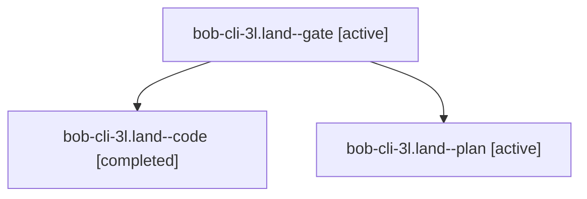

# Session: bob-cli-3l.land

[Agent Hoods](../README.md) / [bbugyi200](../users/bbugyi200/README.md) / [apollo](../users/bbugyi200/machines/apollo/README.md) / [bob-cli-3l](../users/bbugyi200/machines/apollo/hoods/bob-cli-3l/README.md) / bob-cli-3l.land

Owner: `bbugyi200.apollo` · Hood: `bob-cli-3l` · Members: 3 · Bead: [bob-cli-3l](https://github.com/bobs-org/bob-cli--beads/blob/main/pages/bob-cli-3l/README.md)

## Lineage

The diagram is an optional enhancement; the ordered table below contains the same lineage in accessible text.

| Role | Agent | State | Model / provider | Timing | Commits | Prompt | Chat |
|---|---|---|---|---|---:|---|---|
| gate | bob-cli-3l.land--gate | active | gpt-6.1-sol / codex | 2026-10-02T20:11:50.781546+00:00 | 0 | — | [Chat](../agents/bbugyi200.apollo.bob-cli-3l.land--gate/chat.md) |
| code | bob-cli-3l.land--code | completed | muse-spark-1.3-contributor / muse | 2026-10-02T20:12:04.908286+00:00 → 2026-10-02T20:20:13.405212+00:00 | [1](../agents/bbugyi200.apollo.bob-cli-3l.land--code/README.md#commits) | — | [Chat](../agents/bbugyi200.apollo.bob-cli-3l.land--code/chat.md) |
| plan | bob-cli-3l.land--plan | active | gpt-6.1-sol / codex | 2026-10-02T19:58:03.151052+00:00 | 0 | [Prompt](../agents/bbugyi200.apollo.bob-cli-3l.land--plan/prompt.md) | [Chat](../agents/bbugyi200.apollo.bob-cli-3l.land--plan/chat.md) |

## Commits

| Role | Repo | Commit | Subject | Committed |
|---|---|---|---|---|
| code | bob-cli | [`a5224a3`](https://github.com/bobs-org/bob-cli/commit/a5224a3a54ad7f491c7b49530d91355ca2117bbd) | fix(capture): preserve positional Work Log origins for selection-mode unnumbered bullets | 2026-10-02 16:19:01 EDT |

## Neighbors

| Agent | Relation | State |
|---|---|---|
| [bob-cli-3l.1](../agents/bbugyi200.apollo.bob-cli-3l.1/README.md) | bob-cli-3l hood | active |
| [bob-cli-3l.2](../agents/bbugyi200.apollo.bob-cli-3l.2/README.md) | bob-cli-3l hood | active |
