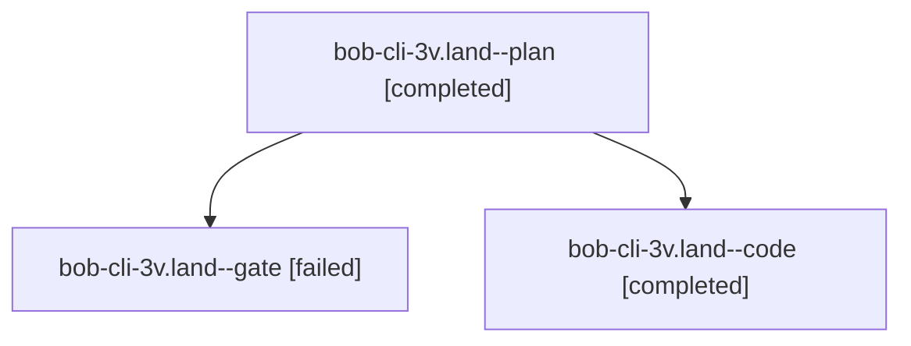

# Session: bob-cli-3v.land

[Agent Hoods](../README.md) / [bbugyi200](../users/bbugyi200/README.md) / [apollo](../users/bbugyi200/machines/apollo/README.md) / [bob-cli-3v](../users/bbugyi200/machines/apollo/hoods/bob-cli-3v/README.md) / bob-cli-3v.land

Owner: `bbugyi200.apollo` · Hood: `bob-cli-3v` · Members: 3 · Bead: [bob-cli-3v](https://github.com/bobs-org/bob-cli--beads/blob/main/pages/bob-cli-3v/README.md)

## Lineage

The diagram is an optional enhancement; the ordered table below contains the same lineage in accessible text.

| Role | Agent | State | Model / provider | Timing | Commits | Prompt | Chat |
|---|---|---|---|---|---:|---|---|
| plan | bob-cli-3v.land--plan | completed | opus / claude | 2026-10-03T16:30:58.188260+00:00 → 2026-10-03T17:03:51.652822+00:00 | 0 | [Prompt](../agents/bbugyi200.apollo.bob-cli-3v.land--plan/prompt.md) | [Chat](../agents/bbugyi200.apollo.bob-cli-3v.land--plan/chat.md) |
| gate | bob-cli-3v.land--gate | failed | opus / claude | 2026-10-03T16:41:59.969625+00:00 → 2026-10-03T16:42:08.477658+00:00 | 0 | — | [Chat](../agents/bbugyi200.apollo.bob-cli-3v.land--gate/chat.md) |
| code | bob-cli-3v.land--code | completed | muse-spark-1.3-contributor / muse | 2026-10-03T16:42:16.346083+00:00 → 2026-10-03T17:03:51.652822+00:00 | [1](../agents/bbugyi200.apollo.bob-cli-3v.land--code/README.md#commits) | — | [Chat](../agents/bbugyi200.apollo.bob-cli-3v.land--code/chat.md) |

## Commits

| Role | Repo | Commit | Subject | Committed |
|---|---|---|---|---|
| code | bob-cli | [`b013618`](https://github.com/bobs-org/bob-cli/commit/b013618ed08ae8c8eb7efacf8872db151caaf58a) | docs(freshness): land rotten keep-streak decision card hardening and contract docs | 2026-10-03 13:01:50 EDT |

## Neighbors

| Agent | Relation | State |
|---|---|---|
| [bob-cli-3v.1](../agents/bbugyi200.apollo.bob-cli-3v.1/README.md) | bob-cli-3v hood | completed |
| [bob-cli-3v.2](../agents/bbugyi200.apollo.bob-cli-3v.2/README.md) | bob-cli-3v hood | completed |
| [bob-cli-3v.3](../agents/bbugyi200.apollo.bob-cli-3v.3/README.md) | bob-cli-3v hood | completed |
| [bob-cli-3v.4](../agents/bbugyi200.apollo.bob-cli-3v.4/README.md) | bob-cli-3v hood | completed |
| [bob-cli-3v.5](../agents/bbugyi200.apollo.bob-cli-3v.5/README.md) | bob-cli-3v hood | completed |
| [bob-cli-3v.6](../agents/bbugyi200.apollo.bob-cli-3v.6/README.md) | bob-cli-3v hood | completed |
