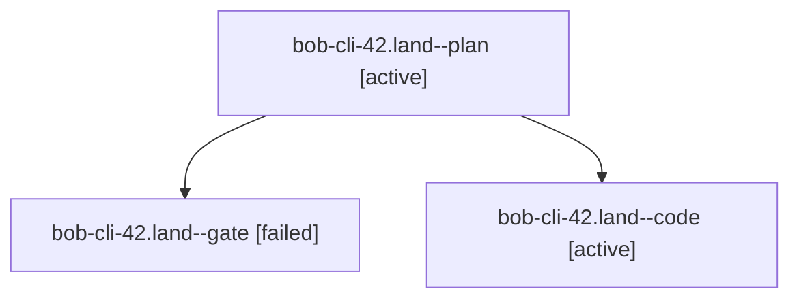

# Session: bob-cli-42.land

[Agent Hoods](../README.md) / [bbugyi200](../users/bbugyi200/README.md) / [apollo](../users/bbugyi200/machines/apollo/README.md) / [bob-cli-42](../users/bbugyi200/machines/apollo/hoods/bob-cli-42/README.md) / bob-cli-42.land

Owner: `bbugyi200.apollo` · Hood: `bob-cli-42` · Members: 3 · Bead: [bob-cli-42](https://github.com/bobs-org/bob-cli--beads/blob/main/pages/bob-cli-42/README.md)

## Lineage

The diagram is an optional enhancement; the ordered table below contains the same lineage in accessible text.

| Role | Agent | State | Model / provider | Timing | Commits | Prompt | Chat |
|---|---|---|---|---|---:|---|---|
| plan | bob-cli-42.land--plan | active | opus / claude | 2026-10-04T00:21:28.065478+00:00 | 0 | [Prompt](../agents/bbugyi200.apollo.bob-cli-42.land--plan/prompt.md) | [Chat](../agents/bbugyi200.apollo.bob-cli-42.land--plan/chat.md) |
| gate | bob-cli-42.land--gate | failed | opus / claude | 2026-10-04T00:36:32.325423+00:00 → 2026-10-04T00:36:40.294384+00:00 | 0 | — | [Chat](../agents/bbugyi200.apollo.bob-cli-42.land--gate/chat.md) |
| code | bob-cli-42.land--code | active | sonnet / claude | 2026-10-04T00:36:46.798097+00:00 | [1](../agents/bbugyi200.apollo.bob-cli-42.land--code/README.md#commits) | — | — |

## Commits

| Role | Repo | Commit | Subject | Committed |
|---|---|---|---|---|
| code | bob-cli | [`b39ef14`](https://github.com/bobs-org/bob-cli/commit/b39ef14f90d485b8245f7f1c70ce7208dca529c0) | docs(task-card): document the scheduling input grammar | 2026-10-03 20:42:03 EDT |

## Neighbors

| Agent | Relation | State |
|---|---|---|
| [bob-cli-42.1](../agents/bbugyi200.apollo.bob-cli-42.1/README.md) | bob-cli-42 hood | completed |
| [bob-cli-42.2](../agents/bbugyi200.apollo.bob-cli-42.2/README.md) | bob-cli-42 hood | completed |
| [bob-cli-42.3](../agents/bbugyi200.apollo.bob-cli-42.3/README.md) | bob-cli-42 hood | completed |
| [bob-cli-42.4](../agents/bbugyi200.apollo.bob-cli-42.4/README.md) | bob-cli-42 hood | completed |
| [bob-cli-42.5](../agents/bbugyi200.apollo.bob-cli-42.5/README.md) | bob-cli-42 hood | completed |
| [bob-cli-42.6](../agents/bbugyi200.apollo.bob-cli-42.6/README.md) | bob-cli-42 hood | completed |
| [bob-cli-42.7](../agents/bbugyi200.apollo.bob-cli-42.7/README.md) | bob-cli-42 hood | completed |
| [bob-cli-42.8](../agents/bbugyi200.apollo.bob-cli-42.8/README.md) | bob-cli-42 hood | completed |
