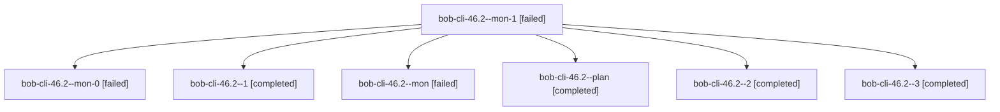

# Session: bob-cli-46.2

[Agent Hoods](../README.md) / [bbugyi200](../users/bbugyi200/README.md) / [apollo](../users/bbugyi200/machines/apollo/README.md) / [bob-cli-46](../users/bbugyi200/machines/apollo/hoods/bob-cli-46/README.md) / bob-cli-46.2

Owner: `bbugyi200.apollo` · Hood: `bob-cli-46` · Members: 7 · Bead: [bob-cli-46.2](https://github.com/bobs-org/bob-cli--beads/blob/main/pages/bob-cli-46/bob-cli-46.2.md)

## Lineage

The diagram is an optional enhancement; the ordered table below contains the same lineage in accessible text.

| Role | Agent | State | Model / provider | Timing | Commits | Prompt | Chat |
|---|---|---|---|---|---:|---|---|
| mon-1 | bob-cli-46.2--mon-1 | failed | grok-4.6 / grok | 2026-10-04T12:43:24.231345+00:00 → 2026-10-04T12:44:47.572963+00:00 | 0 | — | [Chat](../agents/bbugyi200.apollo.bob-cli-46.2--mon-1/chat.md) |
| mon-0 | bob-cli-46.2--mon-0 | failed | grok-4.6 / grok | 2026-10-04T12:36:44.957926+00:00 → 2026-10-04T12:39:11.789696+00:00 | 0 | — | [Chat](../agents/bbugyi200.apollo.bob-cli-46.2--mon-0/chat.md) |
| 1 | bob-cli-46.2--1 | completed | grok-4.6 / grok | 2026-10-04T12:33:31.096413+00:00 → 2026-10-04T12:37:24.153375+00:00 | 0 | [Prompt](../agents/bbugyi200.apollo.bob-cli-46.2--1/prompt.md) | [Chat](../agents/bbugyi200.apollo.bob-cli-46.2--1/chat.md) |
| mon | bob-cli-46.2--mon | failed | grok-4.6 / grok | 2026-10-04T12:32:14.183256+00:00 → 2026-10-04T12:33:31.275756+00:00 | 0 | — | [Chat](../agents/bbugyi200.apollo.bob-cli-46.2--mon/chat.md) |
| plan | bob-cli-46.2--plan | completed | grok-4.6 / grok | 2026-10-04T11:46:36.199420+00:00 → 2026-10-04T12:32:52.594043+00:00 | 0 | [Prompt](../agents/bbugyi200.apollo.bob-cli-46.2--plan/prompt.md) | [Chat](../agents/bbugyi200.apollo.bob-cli-46.2--plan/chat.md) |
| 2 | bob-cli-46.2--2 | completed | grok-4.6 / grok | 2026-10-04T12:39:11.642204+00:00 → 2026-10-04T12:43:59.260535+00:00 | 0 | [Prompt](../agents/bbugyi200.apollo.bob-cli-46.2--2/prompt.md) | [Chat](../agents/bbugyi200.apollo.bob-cli-46.2--2/chat.md) |
| 3 | bob-cli-46.2--3 | completed | grok-4.6 / grok | 2026-10-04T12:44:47.316374+00:00 → 2026-10-04T12:57:18.826604+00:00 | [1](../agents/bbugyi200.apollo.bob-cli-46.2--3/README.md#commits) | [Prompt](../agents/bbugyi200.apollo.bob-cli-46.2--3/prompt.md) | [Chat](../agents/bbugyi200.apollo.bob-cli-46.2--3/chat.md) |

## Commits

| Role | Repo | Commit | Subject | Committed |
|---|---|---|---|---|
| 3 | bob-cli | [`b13f96c`](https://github.com/bobs-org/bob-cli/commit/b13f96ccfbfdaac8c06e20c0b343f0f5cce7de60) | feat(cli): nest task and pomodoro command groups | 2026-10-04 08:56:02 EDT |

## Neighbors

| Agent | Relation | State |
|---|---|---|
| [bob-cli-46.1](../agents/bbugyi200.apollo.bob-cli-46.1/README.md) | bob-cli-46 hood | completed |
| [bob-cli-46.3](bbugyi200.apollo.bob-cli-46.3.md) (session · 5) | bob-cli-46 hood | active 1, completed 2, failed 2 |
| [bob-cli-46.4](../agents/bbugyi200.apollo.bob-cli-46.4/README.md) | bob-cli-46 hood | completed |
| [bob-cli-46.land](../agents/bbugyi200.apollo.bob-cli-46.land/README.md) | bob-cli-46 hood | waiting |
