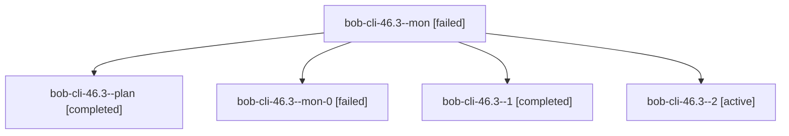

# Session: bob-cli-46.3

[Agent Hoods](../README.md) / [bbugyi200](../users/bbugyi200/README.md) / [apollo](../users/bbugyi200/machines/apollo/README.md) / [bob-cli-46](../users/bbugyi200/machines/apollo/hoods/bob-cli-46/README.md) / bob-cli-46.3

Owner: `bbugyi200.apollo` · Hood: `bob-cli-46` · Members: 5 · Bead: [bob-cli-46.3](https://github.com/bobs-org/bob-cli--beads/blob/main/pages/bob-cli-46/bob-cli-46.3.md)

## Lineage

The diagram is an optional enhancement; the ordered table below contains the same lineage in accessible text.

| Role | Agent | State | Model / provider | Timing | Commits | Prompt | Chat |
|---|---|---|---|---|---:|---|---|
| mon | bob-cli-46.3--mon | failed | grok-4.6 / grok | 2026-10-04T13:25:13.190581+00:00 → 2026-10-04T13:26:20.702472+00:00 | 0 | — | [Chat](../agents/bbugyi200.apollo.bob-cli-46.3--mon/chat.md) |
| plan | bob-cli-46.3--plan | completed | grok-4.6 / grok | 2026-10-04T13:04:38.635791+00:00 → 2026-10-04T13:25:54.544371+00:00 | 0 | [Prompt](../agents/bbugyi200.apollo.bob-cli-46.3--plan/prompt.md) | [Chat](../agents/bbugyi200.apollo.bob-cli-46.3--plan/chat.md) |
| mon-0 | bob-cli-46.3--mon-0 | failed | grok-4.6 / grok | 2026-10-04T13:30:48.769212+00:00 → 2026-10-04T13:32:29.322511+00:00 | 0 | — | [Chat](../agents/bbugyi200.apollo.bob-cli-46.3--mon-0/chat.md) |
| 1 | bob-cli-46.3--1 | completed | grok-4.6 / grok | 2026-10-04T13:26:20.559619+00:00 → 2026-10-04T13:31:24.339727+00:00 | 0 | [Prompt](../agents/bbugyi200.apollo.bob-cli-46.3--1/prompt.md) | [Chat](../agents/bbugyi200.apollo.bob-cli-46.3--1/chat.md) |
| 2 | bob-cli-46.3--2 | active | grok-4.6 / grok | 2026-10-04T13:32:29.051691+00:00 | [1](../agents/bbugyi200.apollo.bob-cli-46.3--2/README.md#commits) | [Prompt](../agents/bbugyi200.apollo.bob-cli-46.3--2/prompt.md) | — |

## Commits

| Role | Repo | Commit | Subject | Committed |
|---|---|---|---|---|
| 2 | bob-cli | [`192e8b5`](https://github.com/bobs-org/bob-cli/commit/192e8b51157a7616ddeecf4161667b0c538699e6) | docs(cli): teach canonical task and pomodoro names | 2026-10-04 09:35:22 EDT |

## Neighbors

| Agent | Relation | State |
|---|---|---|
| [bob-cli-46.1](../agents/bbugyi200.apollo.bob-cli-46.1/README.md) | bob-cli-46 hood | completed |
| [bob-cli-46.2](bbugyi200.apollo.bob-cli-46.2.md) (session · 7) | bob-cli-46 hood | completed 4, failed 3 |
| [bob-cli-46.4](../agents/bbugyi200.apollo.bob-cli-46.4/README.md) | bob-cli-46 hood | completed |
| [bob-cli-46.land](../agents/bbugyi200.apollo.bob-cli-46.land/README.md) | bob-cli-46 hood | waiting |
