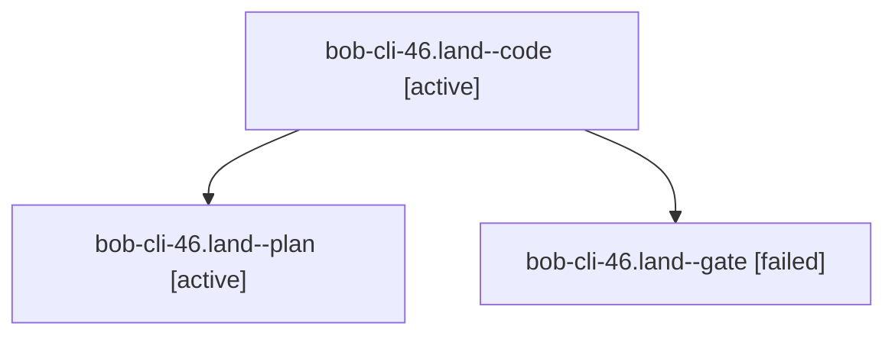

# Session: bob-cli-46.land

[Agent Hoods](../README.md) / [bbugyi200](../users/bbugyi200/README.md) / [apollo](../users/bbugyi200/machines/apollo/README.md) / [bob-cli-46](../users/bbugyi200/machines/apollo/hoods/bob-cli-46/README.md) / bob-cli-46.land

Owner: `bbugyi200.apollo` · Hood: `bob-cli-46` · Members: 3 · Bead: [bob-cli-46](https://github.com/bobs-org/bob-cli--beads/blob/main/pages/bob-cli-46/README.md)

## Lineage

The diagram is an optional enhancement; the ordered table below contains the same lineage in accessible text.

| Role | Agent | State | Model / provider | Timing | Commits | Prompt | Chat |
|---|---|---|---|---|---:|---|---|
| code | bob-cli-46.land--code | active | gpt-6-luna / codex | 2026-10-04T13:53:40.045070+00:00 | [1](../agents/bbugyi200.apollo.bob-cli-46.land--code/README.md#commits) | — | — |
| plan | bob-cli-46.land--plan | active | gpt-6.1-sol / codex | 2026-10-04T13:37:17.991725+00:00 | 0 | [Prompt](../agents/bbugyi200.apollo.bob-cli-46.land--plan/prompt.md) | [Chat](../agents/bbugyi200.apollo.bob-cli-46.land--plan/chat.md) |
| gate | bob-cli-46.land--gate | failed | gpt-6.1-sol / codex | 2026-10-04T13:53:23.300218+00:00 → 2026-10-04T13:53:33.074836+00:00 | 0 | — | [Chat](../agents/bbugyi200.apollo.bob-cli-46.land--gate/chat.md) |

## Commits

| Role | Repo | Commit | Subject | Committed |
|---|---|---|---|---|
| code | bob-cli | [`76df6b6`](https://github.com/bobs-org/bob-cli/commit/76df6b656a963e1defaaf1fa9c83caeb20ffb8aa) | docs(cli): correct nightly archive command and land bob-cli-46 | 2026-10-04 09:59:45 EDT |

## Neighbors

| Agent | Relation | State |
|---|---|---|
| [bob-cli-46.1](../agents/bbugyi200.apollo.bob-cli-46.1/README.md) | bob-cli-46 hood | completed |
| [bob-cli-46.2](bbugyi200.apollo.bob-cli-46.2.md) (session · 7) | bob-cli-46 hood | completed 4, failed 3 |
| [bob-cli-46.3](bbugyi200.apollo.bob-cli-46.3.md) (session · 5) | bob-cli-46 hood | completed 3, failed 2 |
| [bob-cli-46.4](../agents/bbugyi200.apollo.bob-cli-46.4/README.md) | bob-cli-46 hood | completed |
