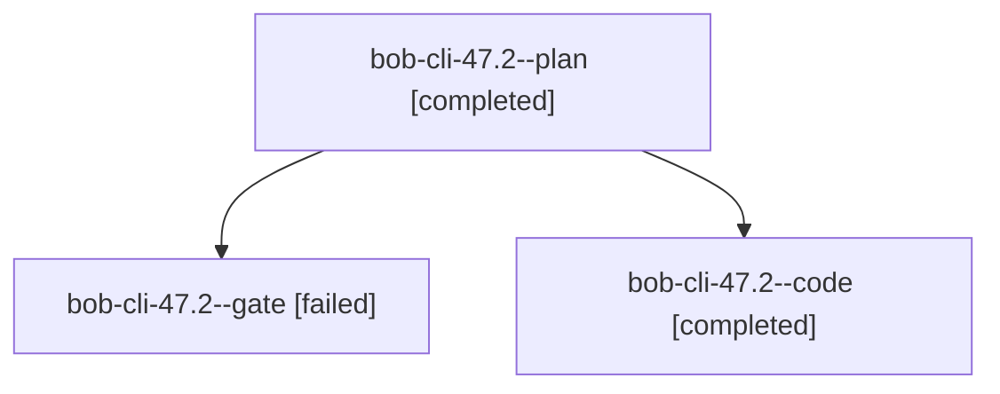

# Session: bob-cli-47.2

[Agent Hoods](../README.md) / [bbugyi200](../users/bbugyi200/README.md) / [apollo](../users/bbugyi200/machines/apollo/README.md) / [bob-cli-47](../users/bbugyi200/machines/apollo/hoods/bob-cli-47/README.md) / bob-cli-47.2

Owner: `bbugyi200.apollo` · Hood: `bob-cli-47` · Members: 3 · Bead: [bob-cli-47.2](https://github.com/bobs-org/bob-cli--beads/blob/main/pages/bob-cli-47/bob-cli-47.2.md)

## Lineage

The diagram is an optional enhancement; the ordered table below contains the same lineage in accessible text.

| Role | Agent | State | Model / provider | Timing | Commits | Prompt | Chat |
|---|---|---|---|---|---:|---|---|
| plan | bob-cli-47.2--plan | completed | grok-4.7 / grok | 2026-10-04T11:44:37.402593+00:00 → 2026-10-04T12:14:38.870109+00:00 | 0 | [Prompt](../agents/bbugyi200.apollo.bob-cli-47.2--plan/prompt.md) | [Chat](../agents/bbugyi200.apollo.bob-cli-47.2--plan/chat.md) |
| gate | bob-cli-47.2--gate | failed | grok-4.7 / grok | 2026-10-04T12:00:07.893329+00:00 → 2026-10-04T12:00:18.361639+00:00 | 0 | — | [Chat](../agents/bbugyi200.apollo.bob-cli-47.2--gate/chat.md) |
| code | bob-cli-47.2--code | completed | grok-4.6 / grok | 2026-10-04T12:00:24.716565+00:00 → 2026-10-04T12:14:38.870109+00:00 | 0 | — | [Chat](../agents/bbugyi200.apollo.bob-cli-47.2--code/chat.md) |

## Neighbors

| Agent | Relation | State |
|---|---|---|
| [bob-cli-47.1](bbugyi200.apollo.bob-cli-47.1.md) (session · 3) | bob-cli-47 hood | completed 2, failed 1 |
| [bob-cli-47.3](bbugyi200.apollo.bob-cli-47.3.md) (session · 3) | bob-cli-47 hood | completed 2, failed 1 |
| [bob-cli-47.4](bbugyi200.apollo.bob-cli-47.4.md) (session · 3) | bob-cli-47 hood | completed 2, failed 1 |
| [bob-cli-47.5](bbugyi200.apollo.bob-cli-47.5.md) (session · 3) | bob-cli-47 hood | active 2, failed 1 |
| [bob-cli-47.land](../agents/bbugyi200.apollo.bob-cli-47.land/README.md) | bob-cli-47 hood | waiting |
