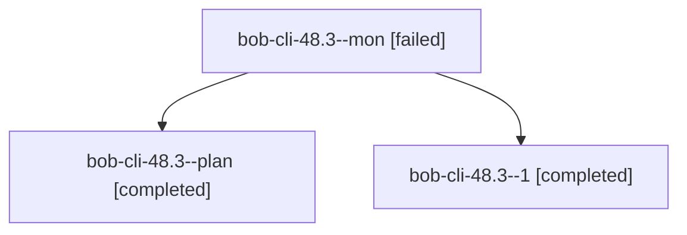

# Session: bob-cli-48.3

[Agent Hoods](../README.md) / [bbugyi200](../users/bbugyi200/README.md) / [apollo](../users/bbugyi200/machines/apollo/README.md) / [bob-cli-48](../users/bbugyi200/machines/apollo/hoods/bob-cli-48/README.md) / bob-cli-48.3

Owner: `bbugyi200.apollo` · Hood: `bob-cli-48` · Members: 3 · Bead: [bob-cli-48.3](https://github.com/bobs-org/bob-cli--beads/blob/main/pages/bob-cli-48/bob-cli-48.3.md)

## Lineage

The diagram is an optional enhancement; the ordered table below contains the same lineage in accessible text.

| Role | Agent | State | Model / provider | Timing | Commits | Prompt | Chat |
|---|---|---|---|---|---:|---|---|
| mon | bob-cli-48.3--mon | failed | grok-4.6 / grok | 2026-10-04T13:45:11.152774+00:00 → 2026-10-04T13:46:23.516229+00:00 | 0 | — | [Chat](../agents/bbugyi200.apollo.bob-cli-48.3--mon/chat.md) |
| plan | bob-cli-48.3--plan | completed | grok-4.6 / grok | 2026-10-04T13:24:18.901380+00:00 → 2026-10-04T13:45:43.647455+00:00 | 0 | [Prompt](../agents/bbugyi200.apollo.bob-cli-48.3--plan/prompt.md) | [Chat](../agents/bbugyi200.apollo.bob-cli-48.3--plan/chat.md) |
| 1 | bob-cli-48.3--1 | completed | grok-4.6 / grok | 2026-10-04T13:46:23.476504+00:00 → 2026-10-04T13:54:13.039406+00:00 | [1](../agents/bbugyi200.apollo.bob-cli-48.3--1/README.md#commits) | [Prompt](../agents/bbugyi200.apollo.bob-cli-48.3--1/prompt.md) | [Chat](../agents/bbugyi200.apollo.bob-cli-48.3--1/chat.md) |

## Commits

| Role | Repo | Commit | Subject | Committed |
|---|---|---|---|---|
| 1 | bob-cli | [`f873b7b`](https://github.com/bobs-org/bob-cli/commit/f873b7b6d6d3d6ee4f8bed8d698e4f7969ae589b) | feat(freshness): add PRE/POST checklist tiers (schema 9) | 2026-10-04 09:53:01 EDT |

## Neighbors

| Agent | Relation | State |
|---|---|---|
| [bob-cli-48.1](../agents/bbugyi200.apollo.bob-cli-48.1/README.md) | bob-cli-48 hood | completed |
| [bob-cli-48.2](../agents/bbugyi200.apollo.bob-cli-48.2/README.md) | bob-cli-48 hood | completed |
| [bob-cli-48.4](../agents/bbugyi200.apollo.bob-cli-48.4/README.md) | bob-cli-48 hood | completed |
| [bob-cli-48.5](../agents/bbugyi200.apollo.bob-cli-48.5/README.md) | bob-cli-48 hood | completed |
| [bob-cli-48.6](../agents/bbugyi200.apollo.bob-cli-48.6/README.md) | bob-cli-48 hood | active |
| [bob-cli-48.land](../agents/bbugyi200.apollo.bob-cli-48.land/README.md) | bob-cli-48 hood | waiting |
