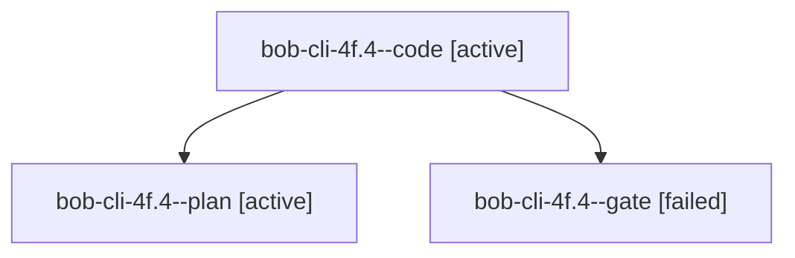

# Session: bob-cli-4f.4

[Agent Hoods](../README.md) / [bbugyi200](../users/bbugyi200/README.md) / [apollo](../users/bbugyi200/machines/apollo/README.md) / [bob-cli-4f](../users/bbugyi200/machines/apollo/hoods/bob-cli-4f/README.md) / bob-cli-4f.4

Owner: `bbugyi200.apollo` · Hood: `bob-cli-4f` · Members: 3 · Bead: [bob-cli-4f.4](https://github.com/bobs-org/bob-cli--beads/blob/main/pages/bob-cli-4f/bob-cli-4f.4.md)

## Lineage

The diagram is an optional enhancement; the ordered table below contains the same lineage in accessible text.

| Role | Agent | State | Model / provider | Timing | Commits | Prompt | Chat |
|---|---|---|---|---|---:|---|---|
| code | bob-cli-4f.4--code | active | gpt-6-luna / codex | 2026-10-05T02:50:10.556832+00:00 | 0 | — | — |
| plan | bob-cli-4f.4--plan | active | grok-4.7 / grok | 2026-10-05T02:39:40.260056+00:00 | 0 | [Prompt](../agents/bbugyi200.apollo.bob-cli-4f.4--plan/prompt.md) | [Chat](../agents/bbugyi200.apollo.bob-cli-4f.4--plan/chat.md) |
| gate | bob-cli-4f.4--gate | failed | grok-4.7 / grok | 2026-10-05T02:49:55.466030+00:00 → 2026-10-05T02:50:04.571192+00:00 | 0 | — | [Chat](../agents/bbugyi200.apollo.bob-cli-4f.4--gate/chat.md) |

## Neighbors

| Agent | Relation | State |
|---|---|---|
| [bob-cli-4f.1](bbugyi200.apollo.bob-cli-4f.1.md) (session · 3) | bob-cli-4f hood | completed 2, failed 1 |
| [bob-cli-4f.2](bbugyi200.apollo.bob-cli-4f.2.md) (session · 3) | bob-cli-4f hood | completed 2, failed 1 |
| [bob-cli-4f.3](bbugyi200.apollo.bob-cli-4f.3.md) (session · 3) | bob-cli-4f hood | completed 2, failed 1 |
| [bob-cli-4f.land](../agents/bbugyi200.apollo.bob-cli-4f.land/README.md) | bob-cli-4f hood | waiting |
