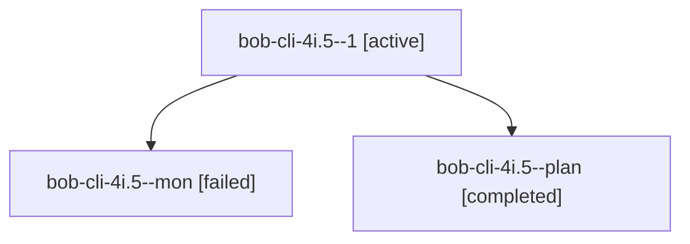

# Session: bob-cli-4i.5

[Agent Hoods](../README.md) / [bbugyi200](../users/bbugyi200/README.md) / [apollo](../users/bbugyi200/machines/apollo/README.md) / [bob-cli-4i](../users/bbugyi200/machines/apollo/hoods/bob-cli-4i/README.md) / bob-cli-4i.5

Owner: `bbugyi200.apollo` · Hood: `bob-cli-4i` · Members: 3 · Bead: [bob-cli-4i.5](https://github.com/bobs-org/bob-cli--beads/blob/main/pages/bob-cli-4i/bob-cli-4i.5.md)

## Lineage

The diagram is an optional enhancement; the ordered table below contains the same lineage in accessible text.

| Role | Agent | State | Model / provider | Timing | Commits | Prompt | Chat |
|---|---|---|---|---|---:|---|---|
| 1 | bob-cli-4i.5--1 | active | muse-spark-1.3-contributor / muse | 2026-10-05T20:30:47.462549+00:00 | 0 | [Prompt](../agents/bbugyi200.apollo.bob-cli-4i.5--1/prompt.md) | — |
| mon | bob-cli-4i.5--mon | failed | muse-spark-1.3-contributor / muse | 2026-10-05T20:20:06.142978+00:00 → 2026-10-05T20:30:47.521975+00:00 | 0 | — | [Chat](../agents/bbugyi200.apollo.bob-cli-4i.5--mon/chat.md) |
| plan | bob-cli-4i.5--plan | completed | muse-spark-1.3-contributor / muse | 2026-10-05T20:09:18.165812+00:00 → 2026-10-05T20:20:36.873767+00:00 | 0 | [Prompt](../agents/bbugyi200.apollo.bob-cli-4i.5--plan/prompt.md) | [Chat](../agents/bbugyi200.apollo.bob-cli-4i.5--plan/chat.md) |

## Neighbors

| Agent | Relation | State |
|---|---|---|
| [bob-cli-4i.1](../agents/bbugyi200.apollo.bob-cli-4i.1/README.md) | bob-cli-4i hood | completed |
| [bob-cli-4i.2](../agents/bbugyi200.apollo.bob-cli-4i.2/README.md) | bob-cli-4i hood | completed |
| [bob-cli-4i.3](../agents/bbugyi200.apollo.bob-cli-4i.3/README.md) | bob-cli-4i hood | completed |
| [bob-cli-4i.4](../agents/bbugyi200.apollo.bob-cli-4i.4/README.md) | bob-cli-4i hood | completed |
| [bob-cli-4i.6](../agents/bbugyi200.apollo.bob-cli-4i.6/README.md) | bob-cli-4i hood | waiting |
| [bob-cli-4i.land](../agents/bbugyi200.apollo.bob-cli-4i.land/README.md) | bob-cli-4i hood | waiting |
