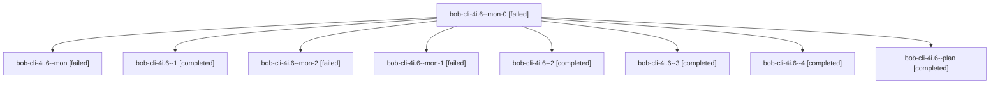

# Session: bob-cli-4i.6

[Agent Hoods](../README.md) / [bbugyi200](../users/bbugyi200/README.md) / [apollo](../users/bbugyi200/machines/apollo/README.md) / [bob-cli-4i](../users/bbugyi200/machines/apollo/hoods/bob-cli-4i/README.md) / bob-cli-4i.6

Owner: `bbugyi200.apollo` · Hood: `bob-cli-4i` · Members: 9 · Bead: [bob-cli-4i.6](https://github.com/bobs-org/bob-cli--beads/blob/main/pages/bob-cli-4i/bob-cli-4i.6.md)

## Lineage

The diagram is an optional enhancement; the ordered table below contains the same lineage in accessible text.

| Role | Agent | State | Model / provider | Timing | Commits | Prompt | Chat |
|---|---|---|---|---|---:|---|---|
| mon-0 | bob-cli-4i.6--mon-0 | failed | muse-spark-1.3-contributor / muse | 2026-10-05T21:22:20.812387+00:00 → 2026-10-05T21:33:35.190874+00:00 | 0 | — | [Chat](../agents/bbugyi200.apollo.bob-cli-4i.6--mon-0/chat.md) |
| mon | bob-cli-4i.6--mon | failed | muse-spark-1.3-contributor / muse | 2026-10-05T21:06:17.734741+00:00 → 2026-10-05T21:20:50.666808+00:00 | 0 | — | [Chat](../agents/bbugyi200.apollo.bob-cli-4i.6--mon/chat.md) |
| 1 | bob-cli-4i.6--1 | completed | muse-spark-1.3-contributor / muse | 2026-10-05T21:20:50.514861+00:00 → 2026-10-05T21:22:48.079243+00:00 | 0 | [Prompt](../agents/bbugyi200.apollo.bob-cli-4i.6--1/prompt.md) | [Chat](../agents/bbugyi200.apollo.bob-cli-4i.6--1/chat.md) |
| mon-2 | bob-cli-4i.6--mon-2 | failed | muse-spark-1.3-contributor / muse | 2026-10-05T21:43:37.727889+00:00 → 2026-10-05T21:48:13.345682+00:00 | 0 | — | [Chat](../agents/bbugyi200.apollo.bob-cli-4i.6--mon-2/chat.md) |
| mon-1 | bob-cli-4i.6--mon-1 | failed | muse-spark-1.3-contributor / muse | 2026-10-05T21:37:36.482605+00:00 → 2026-10-05T21:40:17.678784+00:00 | 0 | — | [Chat](../agents/bbugyi200.apollo.bob-cli-4i.6--mon-1/chat.md) |
| 2 | bob-cli-4i.6--2 | completed | muse-spark-1.3-contributor / muse | 2026-10-05T21:33:35.002899+00:00 → 2026-10-05T21:38:06.299483+00:00 | 0 | [Prompt](../agents/bbugyi200.apollo.bob-cli-4i.6--2/prompt.md) | [Chat](../agents/bbugyi200.apollo.bob-cli-4i.6--2/chat.md) |
| 3 | bob-cli-4i.6--3 | completed | muse-spark-1.3-contributor / muse | 2026-10-05T21:40:17.175107+00:00 → 2026-10-05T21:44:05.774441+00:00 | 0 | [Prompt](../agents/bbugyi200.apollo.bob-cli-4i.6--3/prompt.md) | [Chat](../agents/bbugyi200.apollo.bob-cli-4i.6--3/chat.md) |
| 4 | bob-cli-4i.6--4 | completed | muse-spark-1.3-contributor / muse | 2026-10-05T21:48:13.068852+00:00 → 2026-10-05T21:50:03.034544+00:00 | 0 | [Prompt](../agents/bbugyi200.apollo.bob-cli-4i.6--4/prompt.md) | [Chat](../agents/bbugyi200.apollo.bob-cli-4i.6--4/chat.md) |
| plan | bob-cli-4i.6--plan | completed | muse-spark-1.3-contributor / muse | 2026-10-05T20:49:10.584088+00:00 → 2026-10-05T21:06:51.013171+00:00 | 0 | [Prompt](../agents/bbugyi200.apollo.bob-cli-4i.6--plan/prompt.md) | [Chat](../agents/bbugyi200.apollo.bob-cli-4i.6--plan/chat.md) |

## Neighbors

| Agent | Relation | State |
|---|---|---|
| [bob-cli-4i.1](../agents/bbugyi200.apollo.bob-cli-4i.1/README.md) | bob-cli-4i hood | completed |
| [bob-cli-4i.2](../agents/bbugyi200.apollo.bob-cli-4i.2/README.md) | bob-cli-4i hood | completed |
| [bob-cli-4i.3](../agents/bbugyi200.apollo.bob-cli-4i.3/README.md) | bob-cli-4i hood | completed |
| [bob-cli-4i.4](../agents/bbugyi200.apollo.bob-cli-4i.4/README.md) | bob-cli-4i hood | completed |
| [bob-cli-4i.5](bbugyi200.apollo.bob-cli-4i.5.md) (session · 5) | bob-cli-4i hood | completed 3, failed 2 |
| [bob-cli-4i.7.1](../agents/bbugyi200.apollo.bob-cli-4i.7.1/README.md) | bob-cli-4i hood | completed |
| [bob-cli-4i.7.2](../agents/bbugyi200.apollo.bob-cli-4i.7.2/README.md) | bob-cli-4i hood | completed |
| [bob-cli-4i.7.3](../agents/bbugyi200.apollo.bob-cli-4i.7.3/README.md) | bob-cli-4i hood | completed |
| [bob-cli-4i.7.4](bbugyi200.apollo.bob-cli-4i.7.4.md) (session · 5) | bob-cli-4i hood | active 1, completed 2, failed 2 |
| [bob-cli-4i.7.land](../agents/bbugyi200.apollo.bob-cli-4i.7.land/README.md) | bob-cli-4i hood | waiting |
| [bob-cli-4i.land](bbugyi200.apollo.bob-cli-4i.land.md) (session · 3) | bob-cli-4i hood | failed 3 |
