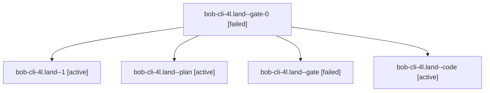

# Session: bob-cli-4l.land

[Agent Hoods](../README.md) / [bbugyi200](../users/bbugyi200/README.md) / [apollo](../users/bbugyi200/machines/apollo/README.md) / [bob-cli-4l](../users/bbugyi200/machines/apollo/hoods/bob-cli-4l/README.md) / bob-cli-4l.land

Owner: `bbugyi200.apollo` · Hood: `bob-cli-4l` · Members: 5 · Bead: [bob-cli-4l](https://github.com/bobs-org/bob-cli--beads/blob/main/pages/bob-cli-4l/README.md)

## Lineage

The diagram is an optional enhancement; the ordered table below contains the same lineage in accessible text.

| Role | Agent | State | Model / provider | Timing | Commits | Prompt | Chat |
|---|---|---|---|---|---:|---|---|
| gate-0 | bob-cli-4l.land--gate-0 | failed | opus / claude | 2026-10-06T12:22:02.402532+00:00 → 2026-10-06T12:22:10.682264+00:00 | 0 | — | [Chat](../agents/bbugyi200.apollo.bob-cli-4l.land--gate-0/chat.md) |
| 1 | bob-cli-4l.land--1 | active | opus / claude | 2026-10-06T12:12:45.818486+00:00 | 0 | — | [Chat](../agents/bbugyi200.apollo.bob-cli-4l.land--1/chat.md) |
| plan | bob-cli-4l.land--plan | active | opus / claude | 2026-10-06T12:00:51.570354+00:00 | 0 | [Prompt](../agents/bbugyi200.apollo.bob-cli-4l.land--plan/prompt.md) | [Chat](../agents/bbugyi200.apollo.bob-cli-4l.land--plan/chat.md) |
| gate | bob-cli-4l.land--gate | failed | opus / claude | 2026-10-06T12:12:38.883413+00:00 → 2026-10-06T12:12:42.084202+00:00 | 0 | — | [Chat](../agents/bbugyi200.apollo.bob-cli-4l.land--gate/chat.md) |
| code | bob-cli-4l.land--code | active | muse-spark-1.3-contributor / muse | 2026-10-06T12:22:14.027433+00:00 | 0 | — | — |

## Neighbors

| Agent | Relation | State |
|---|---|---|
| [bob-cli-4l.1](../agents/bbugyi200.apollo.bob-cli-4l.1/README.md) | bob-cli-4l hood | completed |
| [bob-cli-4l.2](../agents/bbugyi200.apollo.bob-cli-4l.2/README.md) | bob-cli-4l hood | completed |
| [bob-cli-4l.3](../agents/bbugyi200.apollo.bob-cli-4l.3/README.md) | bob-cli-4l hood | completed |
| [bob-cli-4l.4](../agents/bbugyi200.apollo.bob-cli-4l.4/README.md) | bob-cli-4l hood | completed |
| [bob-cli-4l.5](../agents/bbugyi200.apollo.bob-cli-4l.5/README.md) | bob-cli-4l hood | completed |
