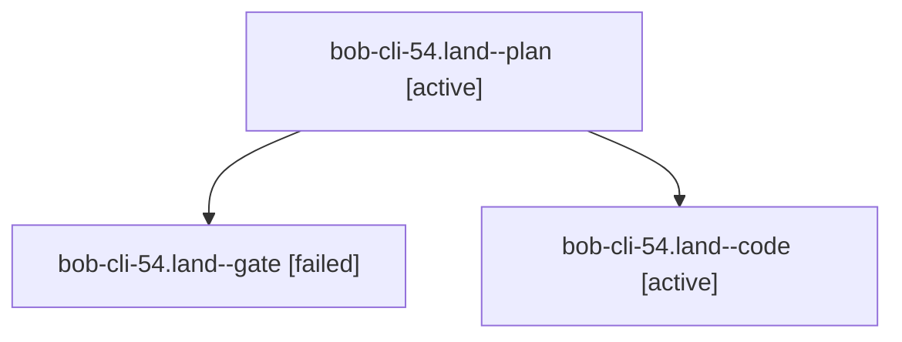

# Session: bob-cli-54.land

[Agent Hoods](../README.md) / [bbugyi200](../users/bbugyi200/README.md) / [apollo](../users/bbugyi200/machines/apollo/README.md) / [bob-cli-54](../users/bbugyi200/machines/apollo/hoods/bob-cli-54/README.md) / bob-cli-54.land

Owner: `bbugyi200.apollo` · Hood: `bob-cli-54` · Members: 3 · Bead: [bob-cli-54](https://github.com/bobs-org/bob-cli--beads/blob/main/pages/bob-cli-54/README.md)

## Lineage

The diagram is an optional enhancement; the ordered table below contains the same lineage in accessible text.

| Role | Agent | State | Model / provider | Timing | Commits | Prompt | Chat |
|---|---|---|---|---|---:|---|---|
| plan | bob-cli-54.land--plan | active | grok-4.7 / grok | 2026-10-07T14:06:58.935151+00:00 | 0 | [Prompt](../agents/bbugyi200.apollo.bob-cli-54.land--plan/prompt.md) | [Chat](../agents/bbugyi200.apollo.bob-cli-54.land--plan/chat.md) |
| gate | bob-cli-54.land--gate | failed | grok-4.7 / grok | 2026-10-07T14:27:30.137035+00:00 → 2026-10-07T14:27:39.403706+00:00 | 0 | — | [Chat](../agents/bbugyi200.apollo.bob-cli-54.land--gate/chat.md) |
| code | bob-cli-54.land--code | active | muse-spark-1.3-contributor / muse | 2026-10-07T14:27:47.392569+00:00 | 0 | — | — |

## Neighbors

| Agent | Relation | State |
|---|---|---|
| [bob-cli-54.1](../agents/bbugyi200.apollo.bob-cli-54.1/README.md) | bob-cli-54 hood | completed |
| [bob-cli-54.2](../agents/bbugyi200.apollo.bob-cli-54.2/README.md) | bob-cli-54 hood | completed |
| [bob-cli-54.3](../agents/bbugyi200.apollo.bob-cli-54.3/README.md) | bob-cli-54 hood | completed |
