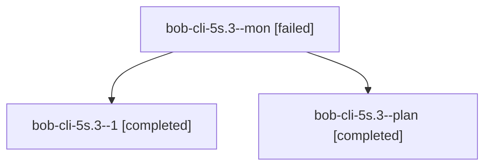

# Session: bob-cli-5s.3

[Agent Hoods](../README.md) / [bbugyi200](../users/bbugyi200/README.md) / [apollo](../users/bbugyi200/machines/apollo/README.md) / [bob-cli-5s](../users/bbugyi200/machines/apollo/hoods/bob-cli-5s/README.md) / bob-cli-5s.3

Owner: `bbugyi200.apollo` · Hood: `bob-cli-5s` · Members: 3 · Bead: [bob-cli-5s.3](https://github.com/bobs-org/bob-cli--beads/blob/main/pages/bob-cli-5s/bob-cli-5s.3.md)

## Lineage

The diagram is an optional enhancement; the ordered table below contains the same lineage in accessible text.

| Role | Agent | State | Model / provider | Timing | Commits | Prompt | Chat |
|---|---|---|---|---|---:|---|---|
| mon | bob-cli-5s.3--mon | failed | muse-spark-1.3-contributor / muse | 2026-10-09T01:39:03.767484+00:00 → 2026-10-09T01:43:26.270147+00:00 | 0 | — | [Chat](../agents/bbugyi200.apollo.bob-cli-5s.3--mon/chat.md) |
| 1 | bob-cli-5s.3--1 | completed | muse-spark-1.3-contributor / muse | 2026-10-09T01:44:48.365178+00:00 → 2026-10-09T01:59:06.985270+00:00 | 0 | [Prompt](../agents/bbugyi200.apollo.bob-cli-5s.3--1/prompt.md) | [Chat](../agents/bbugyi200.apollo.bob-cli-5s.3--1/chat.md) |
| plan | bob-cli-5s.3--plan | completed | muse-spark-1.3-contributor / muse | 2026-10-09T01:25:49.095126+00:00 → 2026-10-09T01:40:40.572253+00:00 | 0 | [Prompt](../agents/bbugyi200.apollo.bob-cli-5s.3--plan/prompt.md) | [Chat](../agents/bbugyi200.apollo.bob-cli-5s.3--plan/chat.md) |

## Neighbors

| Agent | Relation | State |
|---|---|---|
| [bob-cli-5s.1](../agents/bbugyi200.apollo.bob-cli-5s.1/README.md) | bob-cli-5s hood | completed |
| [bob-cli-5s.2](bbugyi200.apollo.bob-cli-5s.2.md) (session · 3) | bob-cli-5s hood | completed 2, failed 1 |
| [bob-cli-5s.4](../agents/bbugyi200.apollo.bob-cli-5s.4/README.md) | bob-cli-5s hood | completed |
| [bob-cli-5s.5](../agents/bbugyi200.apollo.bob-cli-5s.5/README.md) | bob-cli-5s hood | active |
| [bob-cli-5s.6](../agents/bbugyi200.apollo.bob-cli-5s.6/README.md) | bob-cli-5s hood | waiting |
| [bob-cli-5s.7](../agents/bbugyi200.apollo.bob-cli-5s.7/README.md) | bob-cli-5s hood | waiting |
| [bob-cli-5s.8](../agents/bbugyi200.apollo.bob-cli-5s.8/README.md) | bob-cli-5s hood | waiting |
| [bob-cli-5s.9](../agents/bbugyi200.apollo.bob-cli-5s.9/README.md) | bob-cli-5s hood | waiting |
| [bob-cli-5s.land](../agents/bbugyi200.apollo.bob-cli-5s.land/README.md) | bob-cli-5s hood | waiting |
