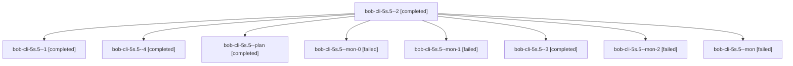

# Session: bob-cli-5s.5

[Agent Hoods](../README.md) / [bbugyi200](../users/bbugyi200/README.md) / [apollo](../users/bbugyi200/machines/apollo/README.md) / [bob-cli-5s](../users/bbugyi200/machines/apollo/hoods/bob-cli-5s/README.md) / bob-cli-5s.5

Owner: `bbugyi200.apollo` · Hood: `bob-cli-5s` · Members: 9 · Bead: [bob-cli-5s.5](https://github.com/bobs-org/bob-cli--beads/blob/main/pages/bob-cli-5s/bob-cli-5s.5.md)

## Lineage

The diagram is an optional enhancement; the ordered table below contains the same lineage in accessible text.

| Role | Agent | State | Model / provider | Timing | Commits | Prompt | Chat |
|---|---|---|---|---|---:|---|---|
| 2 | bob-cli-5s.5--2 | completed | muse-spark-1.3-contributor / muse | 2026-10-09T06:45:17.123653+00:00 → 2026-10-09T07:07:39.491637+00:00 | 0 | [Prompt](../agents/bbugyi200.apollo.bob-cli-5s.5--2/prompt.md) | [Chat](../agents/bbugyi200.apollo.bob-cli-5s.5--2/chat.md) |
| 1 | bob-cli-5s.5--1 | completed | muse-spark-1.3-contributor / muse | 2026-10-09T06:00:53.765549+00:00 → 2026-10-09T06:08:48.210926+00:00 | 0 | [Prompt](../agents/bbugyi200.apollo.bob-cli-5s.5--1/prompt.md) | [Chat](../agents/bbugyi200.apollo.bob-cli-5s.5--1/chat.md) |
| 4 | bob-cli-5s.5--4 | completed | muse-spark-1.3-contributor / muse | 2026-10-09T07:27:09.801745+00:00 → 2026-10-09T07:33:36.717089+00:00 | 0 | [Prompt](../agents/bbugyi200.apollo.bob-cli-5s.5--4/prompt.md) | [Chat](../agents/bbugyi200.apollo.bob-cli-5s.5--4/chat.md) |
| plan | bob-cli-5s.5--plan | completed | muse-spark-1.3-contributor / muse | 2026-10-09T05:24:22.760823+00:00 → 2026-10-09T05:58:51.190352+00:00 | 0 | [Prompt](../agents/bbugyi200.apollo.bob-cli-5s.5--plan/prompt.md) | [Chat](../agents/bbugyi200.apollo.bob-cli-5s.5--plan/chat.md) |
| mon-0 | bob-cli-5s.5--mon-0 | failed | muse-spark-1.3-contributor / muse | 2026-10-09T06:07:00.852279+00:00 → 2026-10-09T06:44:09.766984+00:00 | 0 | — | [Chat](../agents/bbugyi200.apollo.bob-cli-5s.5--mon-0/chat.md) |
| mon-1 | bob-cli-5s.5--mon-1 | failed | muse-spark-1.3-contributor / muse | 2026-10-09T07:05:19.614042+00:00 → 2026-10-09T07:10:15.782498+00:00 | 0 | — | [Chat](../agents/bbugyi200.apollo.bob-cli-5s.5--mon-1/chat.md) |
| 3 | bob-cli-5s.5--3 | completed | muse-spark-1.3-contributor / muse | 2026-10-09T07:10:43.107879+00:00 → 2026-10-09T07:24:02.224026+00:00 | 0 | [Prompt](../agents/bbugyi200.apollo.bob-cli-5s.5--3/prompt.md) | [Chat](../agents/bbugyi200.apollo.bob-cli-5s.5--3/chat.md) |
| mon-2 | bob-cli-5s.5--mon-2 | failed | muse-spark-1.3-contributor / muse | 2026-10-09T07:20:45.301484+00:00 → 2026-10-09T07:26:04.823024+00:00 | 0 | — | [Chat](../agents/bbugyi200.apollo.bob-cli-5s.5--mon-2/chat.md) |
| mon | bob-cli-5s.5--mon | failed | muse-spark-1.3-contributor / muse | 2026-10-09T05:57:11.130062+00:00 → 2026-10-09T05:59:57.146697+00:00 | 0 | — | [Chat](../agents/bbugyi200.apollo.bob-cli-5s.5--mon/chat.md) |

## Neighbors

| Agent | Relation | State |
|---|---|---|
| [bob-cli-5s.1](../agents/bbugyi200.apollo.bob-cli-5s.1/README.md) | bob-cli-5s hood | completed |
| [bob-cli-5s.10.1](../agents/bbugyi200.apollo.bob-cli-5s.10.1/README.md) | bob-cli-5s hood | active |
| [bob-cli-5s.10.2](../agents/bbugyi200.apollo.bob-cli-5s.10.2/README.md) | bob-cli-5s hood | active |
| [bob-cli-5s.10.3](../agents/bbugyi200.apollo.bob-cli-5s.10.3/README.md) | bob-cli-5s hood | waiting |
| [bob-cli-5s.10.4](../agents/bbugyi200.apollo.bob-cli-5s.10.4/README.md) | bob-cli-5s hood | active |
| [bob-cli-5s.10.land](../agents/bbugyi200.apollo.bob-cli-5s.10.land/README.md) | bob-cli-5s hood | waiting |
| [bob-cli-5s.2](bbugyi200.apollo.bob-cli-5s.2.md) (session · 3) | bob-cli-5s hood | completed 2, failed 1 |
| [bob-cli-5s.3](bbugyi200.apollo.bob-cli-5s.3.md) (session · 3) | bob-cli-5s hood | completed 2, failed 1 |
| [bob-cli-5s.4](../agents/bbugyi200.apollo.bob-cli-5s.4/README.md) | bob-cli-5s hood | completed |
| [bob-cli-5s.6](../agents/bbugyi200.apollo.bob-cli-5s.6/README.md) | bob-cli-5s hood | completed |
| [bob-cli-5s.7](../agents/bbugyi200.apollo.bob-cli-5s.7/README.md) | bob-cli-5s hood | completed |
| [bob-cli-5s.8](../agents/bbugyi200.apollo.bob-cli-5s.8/README.md) | bob-cli-5s hood | completed |
| [bob-cli-5s.9](../agents/bbugyi200.apollo.bob-cli-5s.9/README.md) | bob-cli-5s hood | completed |
| [bob-cli-5s.land](bbugyi200.apollo.bob-cli-5s.land.md) (session · 3) | bob-cli-5s hood | completed 1, failed 2 |
