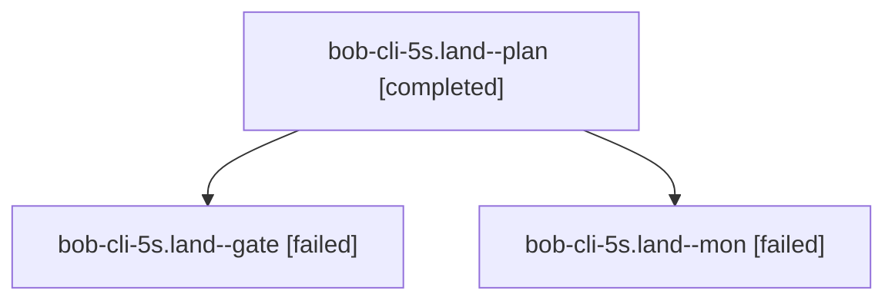

# Session: bob-cli-5s.land

[Agent Hoods](../README.md) / [bbugyi200](../users/bbugyi200/README.md) / [apollo](../users/bbugyi200/machines/apollo/README.md) / [bob-cli-5s](../users/bbugyi200/machines/apollo/hoods/bob-cli-5s/README.md) / bob-cli-5s.land

Owner: `bbugyi200.apollo` · Hood: `bob-cli-5s` · Members: 3 · Bead: [bob-cli-5s](https://github.com/bobs-org/bob-cli--beads/blob/main/pages/bob-cli-5s/README.md)

## Lineage

The diagram is an optional enhancement; the ordered table below contains the same lineage in accessible text.

| Role | Agent | State | Model / provider | Timing | Commits | Prompt | Chat |
|---|---|---|---|---|---:|---|---|
| plan | bob-cli-5s.land--plan | completed | opus / claude | 2026-10-09T11:29:49.796948+00:00 → 2026-10-09T12:01:40.560737+00:00 | 0 | [Prompt](../agents/bbugyi200.apollo.bob-cli-5s.land--plan/prompt.md) | [Chat](../agents/bbugyi200.apollo.bob-cli-5s.land--plan/chat.md) |
| gate | bob-cli-5s.land--gate | failed | opus / claude | 2026-10-09T12:03:56.735966+00:00 → 2026-10-09T12:04:19.767948+00:00 | 0 | — | [Chat](../agents/bbugyi200.apollo.bob-cli-5s.land--gate/chat.md) |
| mon | bob-cli-5s.land--mon | failed | opus / claude | 2026-10-09T12:04:16.357670+00:00 → 2026-10-09T12:05:45.600718+00:00 | 0 | — | [Chat](../agents/bbugyi200.apollo.bob-cli-5s.land--mon/chat.md) |

## Neighbors

| Agent | Relation | State |
|---|---|---|
| [bob-cli-5s.1](../agents/bbugyi200.apollo.bob-cli-5s.1/README.md) | bob-cli-5s hood | completed |
| [bob-cli-5s.10.1](../agents/bbugyi200.apollo.bob-cli-5s.10.1/README.md) | bob-cli-5s hood | active |
| [bob-cli-5s.10.2](../agents/bbugyi200.apollo.bob-cli-5s.10.2/README.md) | bob-cli-5s hood | active |
| [bob-cli-5s.10.3](../agents/bbugyi200.apollo.bob-cli-5s.10.3/README.md) | bob-cli-5s hood | waiting |
| [bob-cli-5s.10.4](../agents/bbugyi200.apollo.bob-cli-5s.10.4/README.md) | bob-cli-5s hood | active |
| [bob-cli-5s.10.land](../agents/bbugyi200.apollo.bob-cli-5s.10.land/README.md) | bob-cli-5s hood | waiting |
| [bob-cli-5s.2](bbugyi200.apollo.bob-cli-5s.2.md) (session · 3) | bob-cli-5s hood | completed 2, failed 1 |
| [bob-cli-5s.3](bbugyi200.apollo.bob-cli-5s.3.md) (session · 3) | bob-cli-5s hood | completed 2, failed 1 |
| [bob-cli-5s.4](../agents/bbugyi200.apollo.bob-cli-5s.4/README.md) | bob-cli-5s hood | completed |
| [bob-cli-5s.5](bbugyi200.apollo.bob-cli-5s.5.md) (session · 9) | bob-cli-5s hood | completed 5, failed 4 |
| [bob-cli-5s.6](../agents/bbugyi200.apollo.bob-cli-5s.6/README.md) | bob-cli-5s hood | completed |
| [bob-cli-5s.7](../agents/bbugyi200.apollo.bob-cli-5s.7/README.md) | bob-cli-5s hood | completed |
| [bob-cli-5s.8](../agents/bbugyi200.apollo.bob-cli-5s.8/README.md) | bob-cli-5s hood | completed |
| [bob-cli-5s.9](../agents/bbugyi200.apollo.bob-cli-5s.9/README.md) | bob-cli-5s hood | completed |
