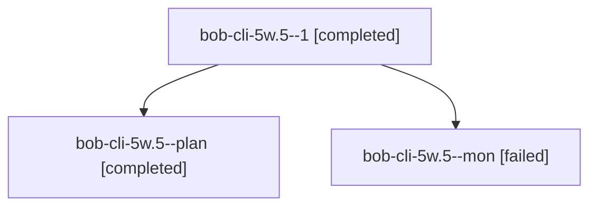

# Session: bob-cli-5w.5

[Agent Hoods](../README.md) / [bbugyi200](../users/bbugyi200/README.md) / [apollo](../users/bbugyi200/machines/apollo/README.md) / [bob-cli-5w](../users/bbugyi200/machines/apollo/hoods/bob-cli-5w/README.md) / bob-cli-5w.5

Owner: `bbugyi200.apollo` · Hood: `bob-cli-5w` · Members: 3 · Bead: [bob-cli-5w.5](https://github.com/bobs-org/bob-cli--beads/blob/main/pages/bob-cli-5w/bob-cli-5w.5.md)

## Lineage

The diagram is an optional enhancement; the ordered table below contains the same lineage in accessible text.

| Role | Agent | State | Model / provider | Timing | Commits | Prompt | Chat |
|---|---|---|---|---|---:|---|---|
| 1 | bob-cli-5w.5--1 | completed | muse-spark-1.3-contributor / muse | 2026-10-09T18:51:32.786420+00:00 → 2026-10-09T18:54:13.052887+00:00 | 0 | [Prompt](../agents/bbugyi200.apollo.bob-cli-5w.5--1/prompt.md) | [Chat](../agents/bbugyi200.apollo.bob-cli-5w.5--1/chat.md) |
| plan | bob-cli-5w.5--plan | completed | muse-spark-1.3-contributor / muse | 2026-10-09T18:27:55.159723+00:00 → 2026-10-09T18:48:18.894664+00:00 | 0 | [Prompt](../agents/bbugyi200.apollo.bob-cli-5w.5--plan/prompt.md) | [Chat](../agents/bbugyi200.apollo.bob-cli-5w.5--plan/chat.md) |
| mon | bob-cli-5w.5--mon | failed | muse-spark-1.3-contributor / muse | 2026-10-09T18:47:38.590911+00:00 → 2026-10-09T18:51:32.966499+00:00 | 0 | — | [Chat](../agents/bbugyi200.apollo.bob-cli-5w.5--mon/chat.md) |

## Neighbors

| Agent | Relation | State |
|---|---|---|
| [bob-cli-5w.1](../agents/bbugyi200.apollo.bob-cli-5w.1/README.md) | bob-cli-5w hood | completed |
| [bob-cli-5w.10](../agents/bbugyi200.apollo.bob-cli-5w.10/README.md) | bob-cli-5w hood | completed |
| [bob-cli-5w.11](../agents/bbugyi200.apollo.bob-cli-5w.11/README.md) | bob-cli-5w hood | completed |
| [bob-cli-5w.2](../agents/bbugyi200.apollo.bob-cli-5w.2/README.md) | bob-cli-5w hood | completed |
| [bob-cli-5w.3](../agents/bbugyi200.apollo.bob-cli-5w.3/README.md) | bob-cli-5w hood | completed |
| [bob-cli-5w.4](../agents/bbugyi200.apollo.bob-cli-5w.4/README.md) | bob-cli-5w hood | completed |
| [bob-cli-5w.6](../agents/bbugyi200.apollo.bob-cli-5w.6/README.md) | bob-cli-5w hood | completed |
| [bob-cli-5w.7](../agents/bbugyi200.apollo.bob-cli-5w.7/README.md) | bob-cli-5w hood | completed |
| [bob-cli-5w.8](../agents/bbugyi200.apollo.bob-cli-5w.8/README.md) | bob-cli-5w hood | completed |
| [bob-cli-5w.9](../agents/bbugyi200.apollo.bob-cli-5w.9/README.md) | bob-cli-5w hood | completed |
| [bob-cli-5w.land](bbugyi200.apollo.bob-cli-5w.land.md) (session · 3) | bob-cli-5w hood | active 2, failed 1 |
| [bob-cli-5w.land](../agents/bbugyi200.apollo.bob-cli-5w.land/README.md) | bob-cli-5w hood | waiting |
