# Session: bob-cli-60.2

[Agent Hoods](../README.md) / [bbugyi200](../users/bbugyi200/README.md) / [apollo](../users/bbugyi200/machines/apollo/README.md) / [bob-cli-60](../users/bbugyi200/machines/apollo/hoods/bob-cli-60/README.md) / bob-cli-60.2

Owner: `bbugyi200.apollo` · Hood: `bob-cli-60` · Members: 17 · Bead: [bob-cli-60.2](https://github.com/bobs-org/bob-cli--beads/blob/main/pages/bob-cli-60/bob-cli-60.2.md)

## Lineage

```mermaid
flowchart TD
  n0["bob-cli-60.2--8 [completed]"]
  n1["bob-cli-60.2--mon-1 [failed]"]
  n0 --> n1
  n2["bob-cli-60.2--6 [completed]"]
  n0 --> n2
  n3["bob-cli-60.2--plan [completed]"]
  n0 --> n3
  n4["bob-cli-60.2--7 [completed]"]
  n0 --> n4
  n5["bob-cli-60.2--mon-2 [failed]"]
  n0 --> n5
  n6["bob-cli-60.2--3 [completed]"]
  n0 --> n6
  n7["bob-cli-60.2--mon [failed]"]
  n0 --> n7
  n8["bob-cli-60.2--5 [completed]"]
  n0 --> n8
  n9["bob-cli-60.2--2 [completed]"]
  n0 --> n9
  n10["bob-cli-60.2--mon-3 [failed]"]
  n0 --> n10
  n11["bob-cli-60.2--mon-5 [failed]"]
  n0 --> n11
  n12["bob-cli-60.2--mon-0 [failed]"]
  n0 --> n12
  n13["bob-cli-60.2--4 [completed]"]
  n0 --> n13
  n14["bob-cli-60.2--mon-4 [failed]"]
  n0 --> n14
  n15["bob-cli-60.2--1 [completed]"]
  n0 --> n15
  n16["bob-cli-60.2--mon-6 [failed]"]
  n0 --> n16
```

The diagram is an optional enhancement; the ordered table below contains the same lineage in accessible text.

| Role | Agent | State | Model / provider | Timing | Commits | Prompt | Chat |
|---|---|---|---|---|---:|---|---|
| 8 | bob-cli-60.2--8 | completed | muse-spark-1.3-contributor / muse | 2026-10-09T21:14:15.139018+00:00 → 2026-10-09T21:16:34.979669+00:00 | 0 | [Prompt](../agents/bbugyi200.apollo.bob-cli-60.2--8/prompt.md) | [Chat](../agents/bbugyi200.apollo.bob-cli-60.2--8/chat.md) |
| mon-1 | bob-cli-60.2--mon-1 | failed | muse-spark-1.3-contributor / muse | 2026-10-09T19:25:44.381511+00:00 → 2026-10-09T19:46:59.233499+00:00 | 0 | — | [Chat](../agents/bbugyi200.apollo.bob-cli-60.2--mon-1/chat.md) |
| 6 | bob-cli-60.2--6 | completed | muse-spark-1.3-contributor / muse | 2026-10-09T20:58:02.659504+00:00 → 2026-10-09T21:00:37.887819+00:00 | 0 | [Prompt](../agents/bbugyi200.apollo.bob-cli-60.2--6/prompt.md) | [Chat](../agents/bbugyi200.apollo.bob-cli-60.2--6/chat.md) |
| plan | bob-cli-60.2--plan | completed | muse-spark-1.3-contributor / muse | 2026-10-09T18:30:28.654512+00:00 → 2026-10-09T18:39:05.151905+00:00 | 0 | [Prompt](../agents/bbugyi200.apollo.bob-cli-60.2--plan/prompt.md) | [Chat](../agents/bbugyi200.apollo.bob-cli-60.2--plan/chat.md) |
| 7 | bob-cli-60.2--7 | completed | muse-spark-1.3-contributor / muse | 2026-10-09T21:04:57.230775+00:00 → 2026-10-09T21:07:47.313200+00:00 | 0 | [Prompt](../agents/bbugyi200.apollo.bob-cli-60.2--7/prompt.md) | [Chat](../agents/bbugyi200.apollo.bob-cli-60.2--7/chat.md) |
| mon-2 | bob-cli-60.2--mon-2 | failed | muse-spark-1.3-contributor / muse | 2026-10-09T19:49:38.659669+00:00 → 2026-10-09T20:10:52.879282+00:00 | 0 | — | [Chat](../agents/bbugyi200.apollo.bob-cli-60.2--mon-2/chat.md) |
| 3 | bob-cli-60.2--3 | completed | muse-spark-1.3-contributor / muse | 2026-10-09T19:46:58.775857+00:00 → 2026-10-09T19:50:18.094576+00:00 | 0 | [Prompt](../agents/bbugyi200.apollo.bob-cli-60.2--3/prompt.md) | [Chat](../agents/bbugyi200.apollo.bob-cli-60.2--3/chat.md) |
| mon | bob-cli-60.2--mon | failed | muse-spark-1.3-contributor / muse | 2026-10-09T18:38:21.032082+00:00 → 2026-10-09T18:59:40.188768+00:00 | 0 | — | [Chat](../agents/bbugyi200.apollo.bob-cli-60.2--mon/chat.md) |
| 5 | bob-cli-60.2--5 | completed | muse-spark-1.3-contributor / muse | 2026-10-09T20:34:41.063592+00:00 → 2026-10-09T20:37:20.874965+00:00 | 0 | [Prompt](../agents/bbugyi200.apollo.bob-cli-60.2--5/prompt.md) | [Chat](../agents/bbugyi200.apollo.bob-cli-60.2--5/chat.md) |
| 2 | bob-cli-60.2--2 | completed | muse-spark-1.3-contributor / muse | 2026-10-09T19:23:16.248953+00:00 → 2026-10-09T19:26:21.001629+00:00 | 0 | [Prompt](../agents/bbugyi200.apollo.bob-cli-60.2--2/prompt.md) | [Chat](../agents/bbugyi200.apollo.bob-cli-60.2--2/chat.md) |
| mon-3 | bob-cli-60.2--mon-3 | failed | muse-spark-1.3-contributor / muse | 2026-10-09T20:13:33.375844+00:00 → 2026-10-09T20:34:41.257912+00:00 | 0 | — | [Chat](../agents/bbugyi200.apollo.bob-cli-60.2--mon-3/chat.md) |
| mon-5 | bob-cli-60.2--mon-5 | failed | muse-spark-1.3-contributor / muse | 2026-10-09T21:00:00.349509+00:00 → 2026-10-09T21:04:57.534695+00:00 | 0 | — | [Chat](../agents/bbugyi200.apollo.bob-cli-60.2--mon-5/chat.md) |
| mon-0 | bob-cli-60.2--mon-0 | failed | muse-spark-1.3-contributor / muse | 2026-10-09T19:01:58.345157+00:00 → 2026-10-09T19:23:16.577468+00:00 | 0 | — | [Chat](../agents/bbugyi200.apollo.bob-cli-60.2--mon-0/chat.md) |
| 4 | bob-cli-60.2--4 | completed | muse-spark-1.3-contributor / muse | 2026-10-09T20:10:52.377906+00:00 → 2026-10-09T20:14:08.033643+00:00 | 0 | [Prompt](../agents/bbugyi200.apollo.bob-cli-60.2--4/prompt.md) | [Chat](../agents/bbugyi200.apollo.bob-cli-60.2--4/chat.md) |
| mon-4 | bob-cli-60.2--mon-4 | failed | muse-spark-1.3-contributor / muse | 2026-10-09T20:36:47.520572+00:00 → 2026-10-09T20:58:02.785202+00:00 | 0 | — | [Chat](../agents/bbugyi200.apollo.bob-cli-60.2--mon-4/chat.md) |
| 1 | bob-cli-60.2--1 | completed | muse-spark-1.3-contributor / muse | 2026-10-09T18:59:39.890394+00:00 → 2026-10-09T19:02:48.925675+00:00 | 0 | [Prompt](../agents/bbugyi200.apollo.bob-cli-60.2--1/prompt.md) | [Chat](../agents/bbugyi200.apollo.bob-cli-60.2--1/chat.md) |
| mon-6 | bob-cli-60.2--mon-6 | failed | muse-spark-1.3-contributor / muse | 2026-10-09T21:07:12.131860+00:00 → 2026-10-09T21:14:15.212228+00:00 | 0 | — | [Chat](../agents/bbugyi200.apollo.bob-cli-60.2--mon-6/chat.md) |

## Neighbors

| Agent | Relation | State |
|---|---|---|
| [bob-cli-60.1](../agents/bbugyi200.apollo.bob-cli-60.1/README.md) | bob-cli-60 hood | completed |
| [bob-cli-60.land](bbugyi200.apollo.bob-cli-60.land.md) (session · 3) | bob-cli-60 hood | active 2, failed 1 |
