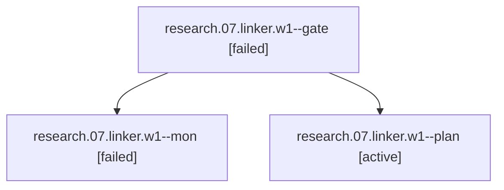

# Session: research.07.linker.w1

[Agent Hoods](../README.md) / [bbugyi200](../users/bbugyi200/README.md) / [apollo](../users/bbugyi200/machines/apollo/README.md) / [research](../users/bbugyi200/machines/apollo/hoods/research/README.md) / research.07.linker.w1

Owner: `bbugyi200.apollo` · Hood: `research` · Members: 3

## Lineage

The diagram is an optional enhancement; the ordered table below contains the same lineage in accessible text.

| Role | Agent | State | Model / provider | Timing | Commits | Prompt | Chat |
|---|---|---|---|---|---:|---|---|
| gate | research.07.linker.w1--gate | failed | opus / claude | 2026-10-04T13:05:06.444487+00:00 → 2026-10-04T13:05:17.005574+00:00 | 0 | — | [Chat](../agents/bbugyi200.apollo.research.07.linker.w1--gate/chat.md) |
| mon | research.07.linker.w1--mon | failed | opus / claude | 2026-10-04T13:05:16.080201+00:00 → 2026-10-04T13:06:14.669798+00:00 | 0 | — | [Chat](../agents/bbugyi200.apollo.research.07.linker.w1--mon/chat.md) |
| plan | research.07.linker.w1--plan | active | opus / claude | 2026-10-04T12:45:54.808448+00:00 | 0 | [Prompt](../agents/bbugyi200.apollo.research.07.linker.w1--plan/prompt.md) | [Chat](../agents/bbugyi200.apollo.research.07.linker.w1--plan/chat.md) |

## Neighbors

| Agent | Relation | State |
|---|---|---|
| [research.07.linker](../agents/bbugyi200.apollo.research.07.linker/README.md) | ancestor | active |
| [research.07.linker.w0](../agents/bbugyi200.apollo.research.07.linker.w0/README.md) | research.07.linker hood | active |
| [research.07.audio](../agents/bbugyi200.apollo.research.07.audio/README.md) | research.07 hood | active |
| [research.07.cdx](../agents/bbugyi200.apollo.research.07.cdx/README.md) | research.07 hood | active |
| [research.07.cld](../agents/bbugyi200.apollo.research.07.cld/README.md) | research.07 hood | active |
| [research.07.final](../agents/bbugyi200.apollo.research.07.final/README.md) | research.07 hood | active |
| [research.07.gem](../agents/bbugyi200.apollo.research.07.gem/README.md) | research.07 hood | active |
| [research.07.grk](../agents/bbugyi200.apollo.research.07.grk/README.md) | research.07 hood | active |
| [research.07.image](../agents/bbugyi200.apollo.research.07.image/README.md) | research.07 hood | active |
| [research.0.cdx](../agents/bbugyi200.apollo.research.0.cdx/README.md) | research hood | completed |
| [research.0.cld](../agents/bbugyi200.apollo.research.0.cld/README.md) | research hood | completed |
| [research.0.final](../agents/bbugyi200.apollo.research.0.final/README.md) | research hood | completed |
| [research.0.final.f1](../agents/bbugyi200.apollo.research.0.final.f1/README.md) | research hood | completed |
| [research.0.image](../agents/bbugyi200.apollo.research.0.image/README.md) | research hood | completed |
| [research.00.cdx](../agents/bbugyi200.apollo.research.00.cdx/README.md) | research hood | active |
| [research.00.cld](../agents/bbugyi200.apollo.research.00.cld/README.md) | research hood | active |
| [research.00.final](../agents/bbugyi200.apollo.research.00.final/README.md) | research hood | active |
| [research.00.gem](../agents/bbugyi200.apollo.research.00.gem/README.md) | research hood | active |
| [research.00.grk](../agents/bbugyi200.apollo.research.00.grk/README.md) | research hood | active |
| [research.00.image](../agents/bbugyi200.apollo.research.00.image/README.md) | research hood | active |
| [research.00.linker](../agents/bbugyi200.apollo.research.00.linker/README.md) | research hood | active |
| [research.00.mus](../agents/bbugyi200.apollo.research.00.mus/README.md) | research hood | active |
| [research.01.cdx](../agents/bbugyi200.apollo.research.01.cdx/README.md) | research hood | active |
| [research.01.cld](../agents/bbugyi200.apollo.research.01.cld/README.md) | research hood | active |
| [research.01.final](../agents/bbugyi200.apollo.research.01.final/README.md) | research hood | active |
| [research.01.gem](../agents/bbugyi200.apollo.research.01.gem/README.md) | research hood | active |
| [research.01.grk](../agents/bbugyi200.apollo.research.01.grk/README.md) | research hood | active |
| [research.01.image](../agents/bbugyi200.apollo.research.01.image/README.md) | research hood | active |
| [research.01.linker](../agents/bbugyi200.apollo.research.01.linker/README.md) | research hood | active |
| [research.01.mus](../agents/bbugyi200.apollo.research.01.mus/README.md) | research hood | active |
| [research.03.audio](../agents/bbugyi200.apollo.research.03.audio/README.md) | research hood | active |
| [research.03.cdx](../agents/bbugyi200.apollo.research.03.cdx/README.md) | research hood | active |
| [research.03.cld](../agents/bbugyi200.apollo.research.03.cld/README.md) | research hood | active |
| [research.03.final](../agents/bbugyi200.apollo.research.03.final/README.md) | research hood | active |
| [research.03.gem](../agents/bbugyi200.apollo.research.03.gem/README.md) | research hood | active |
| [research.03.grk](../agents/bbugyi200.apollo.research.03.grk/README.md) | research hood | active |
| [research.03.image](../agents/bbugyi200.apollo.research.03.image/README.md) | research hood | active |
| [research.03.linker](../agents/bbugyi200.apollo.research.03.linker/README.md) | research hood | active |
| [research.03.mus](../agents/bbugyi200.apollo.research.03.mus/README.md) | research hood | active |
| [research.04.audio](../agents/bbugyi200.apollo.research.04.audio/README.md) | research hood | active |
| [research.04.cdx](../agents/bbugyi200.apollo.research.04.cdx/README.md) | research hood | active |
| [research.04.cld](../agents/bbugyi200.apollo.research.04.cld/README.md) | research hood | active |
| [research.04.final](../agents/bbugyi200.apollo.research.04.final/README.md) | research hood | active |
| [research.04.gem](../agents/bbugyi200.apollo.research.04.gem/README.md) | research hood | active |
| [research.04.grk](../agents/bbugyi200.apollo.research.04.grk/README.md) | research hood | active |
| [research.04.image](../agents/bbugyi200.apollo.research.04.image/README.md) | research hood | active |
| [research.04.linker](../agents/bbugyi200.apollo.research.04.linker/README.md) | research hood | active |
| [research.04.mus](../agents/bbugyi200.apollo.research.04.mus/README.md) | research hood | active |
| [research.05.audio](../agents/bbugyi200.apollo.research.05.audio/README.md) | research hood | active |
| [research.05.cdx](../agents/bbugyi200.apollo.research.05.cdx/README.md) | research hood | active |
| [research.05.cld](../agents/bbugyi200.apollo.research.05.cld/README.md) | research hood | active |
| [research.05.final](../agents/bbugyi200.apollo.research.05.final/README.md) | research hood | active |
| [research.05.gem](../agents/bbugyi200.apollo.research.05.gem/README.md) | research hood | active |
| [research.05.grk](../agents/bbugyi200.apollo.research.05.grk/README.md) | research hood | active |
| [research.05.image](../agents/bbugyi200.apollo.research.05.image/README.md) | research hood | active |
| [research.05.linker](../agents/bbugyi200.apollo.research.05.linker/README.md) | research hood | active |
| [research.05.linker.w0](bbugyi200.apollo.research.05.linker.w0.md) (session · 3) | research hood | active 1, failed 2 |
| [research.06.audio](../agents/bbugyi200.apollo.research.06.audio/README.md) | research hood | active |
| [research.06.cdx](../agents/bbugyi200.apollo.research.06.cdx/README.md) | research hood | active |
| … and 129 more in the [hood roster](../users/bbugyi200/machines/apollo/hoods/research/README.md) | research hood | — |
