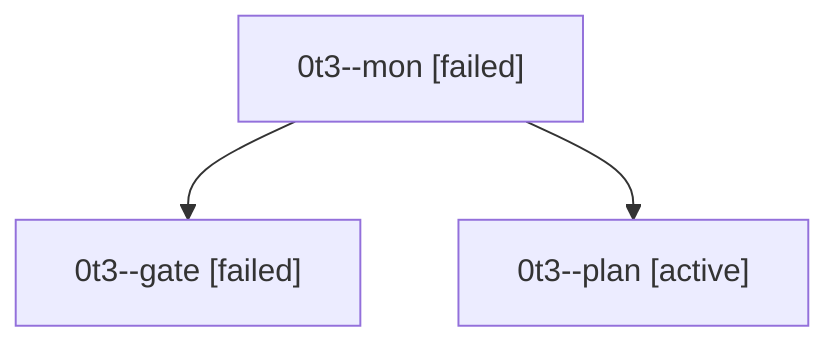

# Session: 0t3

[Agent Hoods](../README.md) / [bbugyi200](../users/bbugyi200/README.md) / [athena](../users/bbugyi200/machines/athena/README.md) / [0t3](../users/bbugyi200/machines/athena/hoods/0t3/README.md) / 0t3

Owner: `bbugyi200.athena` · Hood: `0t3` · Members: 3

## Lineage

The diagram is an optional enhancement; the ordered table below contains the same lineage in accessible text.

| Role | Agent | State | Model / provider | Timing | Commits | Prompt | Chat |
|---|---|---|---|---|---:|---|---|
| mon | 0t3--mon | failed | opus / claude | 2026-09-27T14:38:04.878974+00:00 → 2026-09-27T14:40:48.610587+00:00 | 0 | — | [Chat](../agents/bbugyi200.athena.0t3--mon/chat.md) |
| gate | 0t3--gate | failed | opus / claude | 2026-09-27T14:37:46.155989+00:00 → 2026-09-27T14:38:06.227165+00:00 | 0 | — | [Chat](../agents/bbugyi200.athena.0t3--gate/chat.md) |
| plan | 0t3--plan | active | opus / claude | 2026-09-27T14:17:55.856342+00:00 | 0 | [Prompt](../agents/bbugyi200.athena.0t3--plan/prompt.md) | [Chat](../agents/bbugyi200.athena.0t3--plan/chat.md) |
