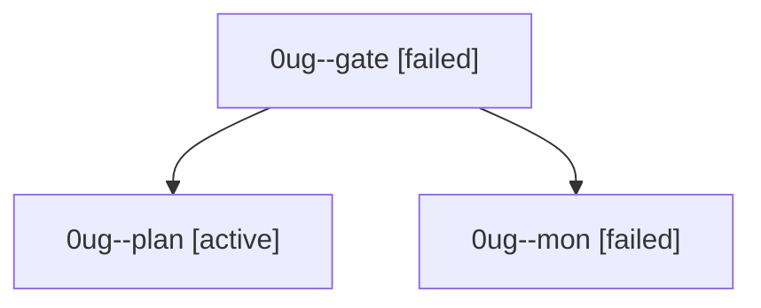

# Session: 0ug

[Agent Hoods](../README.md) / [bbugyi200](../users/bbugyi200/README.md) / [athena](../users/bbugyi200/machines/athena/README.md) / [0ug](../users/bbugyi200/machines/athena/hoods/0ug/README.md) / 0ug

Owner: `bbugyi200.athena` · Hood: `0ug` · Members: 3

## Lineage

The diagram is an optional enhancement; the ordered table below contains the same lineage in accessible text.

| Role | Agent | State | Model / provider | Timing | Commits | Prompt | Chat |
|---|---|---|---|---|---:|---|---|
| gate | 0ug--gate | failed | opus / claude | 2026-09-30T17:42:12.910955+00:00 → 2026-09-30T17:42:45.034828+00:00 | 0 | — | [Chat](../agents/bbugyi200.athena.0ug--gate/chat.md) |
| plan | 0ug--plan | active | opus / claude | 2026-09-30T17:21:37.668672+00:00 | 0 | [Prompt](../agents/bbugyi200.athena.0ug--plan/prompt.md) | [Chat](../agents/bbugyi200.athena.0ug--plan/chat.md) |
| mon | 0ug--mon | failed | opus / claude | 2026-09-30T17:42:43.434842+00:00 → 2026-09-30T17:45:18.093449+00:00 | 0 | — | [Chat](../agents/bbugyi200.athena.0ug--mon/chat.md) |
