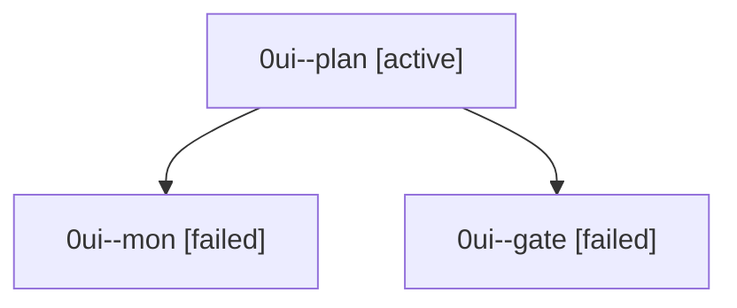

# Session: 0ui

[Agent Hoods](../README.md) / [bbugyi200](../users/bbugyi200/README.md) / [athena](../users/bbugyi200/machines/athena/README.md) / [0ui](../users/bbugyi200/machines/athena/hoods/0ui/README.md) / 0ui

Owner: `bbugyi200.athena` · Hood: `0ui` · Members: 3

## Lineage

The diagram is an optional enhancement; the ordered table below contains the same lineage in accessible text.

| Role | Agent | State | Model / provider | Timing | Commits | Prompt | Chat |
|---|---|---|---|---|---:|---|---|
| plan | 0ui--plan | active | opus / claude | 2026-09-30T22:25:19.763873+00:00 | 0 | [Prompt](../agents/bbugyi200.athena.0ui--plan/prompt.md) | [Chat](../agents/bbugyi200.athena.0ui--plan/chat.md) |
| mon | 0ui--mon | failed | opus / claude | 2026-09-30T22:46:52.054691+00:00 → 2026-09-30T22:48:48.139270+00:00 | 0 | — | [Chat](../agents/bbugyi200.athena.0ui--mon/chat.md) |
| gate | 0ui--gate | failed | opus / claude | 2026-09-30T22:46:32.200676+00:00 → 2026-09-30T22:46:52.971065+00:00 | 0 | — | [Chat](../agents/bbugyi200.athena.0ui--gate/chat.md) |
