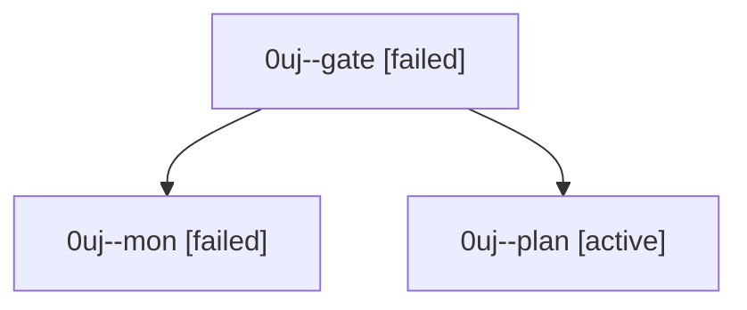

# Session: 0uj

[Agent Hoods](../README.md) / [bbugyi200](../users/bbugyi200/README.md) / [athena](../users/bbugyi200/machines/athena/README.md) / [0uj](../users/bbugyi200/machines/athena/hoods/0uj/README.md) / 0uj

Owner: `bbugyi200.athena` · Hood: `0uj` · Members: 3

## Lineage

The diagram is an optional enhancement; the ordered table below contains the same lineage in accessible text.

| Role | Agent | State | Model / provider | Timing | Commits | Prompt | Chat |
|---|---|---|---|---|---:|---|---|
| gate | 0uj--gate | failed | opus / claude | 2026-10-01T01:30:56.358818+00:00 → 2026-10-01T01:31:23.846926+00:00 | 0 | — | [Chat](../agents/bbugyi200.athena.0uj--gate/chat.md) |
| mon | 0uj--mon | failed | opus / claude | 2026-10-01T01:31:23.159449+00:00 → 2026-10-01T01:33:57.304456+00:00 | 0 | — | [Chat](../agents/bbugyi200.athena.0uj--mon/chat.md) |
| plan | 0uj--plan | active | opus / claude | 2026-10-01T01:12:58.221373+00:00 | 0 | [Prompt](../agents/bbugyi200.athena.0uj--plan/prompt.md) | [Chat](../agents/bbugyi200.athena.0uj--plan/chat.md) |
