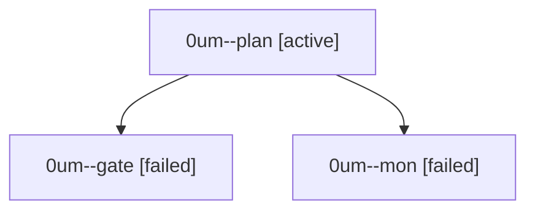

# Session: 0um

[Agent Hoods](../README.md) / [bbugyi200](../users/bbugyi200/README.md) / [athena](../users/bbugyi200/machines/athena/README.md) / [0um](../users/bbugyi200/machines/athena/hoods/0um/README.md) / 0um

Owner: `bbugyi200.athena` · Hood: `0um` · Members: 3

## Lineage

The diagram is an optional enhancement; the ordered table below contains the same lineage in accessible text.

| Role | Agent | State | Model / provider | Timing | Commits | Prompt | Chat |
|---|---|---|---|---|---:|---|---|
| plan | 0um--plan | active | opus / claude | 2026-10-01T03:40:05.574991+00:00 | 0 | [Prompt](../agents/bbugyi200.athena.0um--plan/prompt.md) | [Chat](../agents/bbugyi200.athena.0um--plan/chat.md) |
| gate | 0um--gate | failed | opus / claude | 2026-10-01T03:56:07.280866+00:00 → 2026-10-01T03:56:44.465531+00:00 | 0 | — | [Chat](../agents/bbugyi200.athena.0um--gate/chat.md) |
| mon | 0um--mon | failed | opus / claude | 2026-10-01T03:56:43.695162+00:00 → 2026-10-01T03:58:18.294137+00:00 | 0 | — | [Chat](../agents/bbugyi200.athena.0um--mon/chat.md) |
