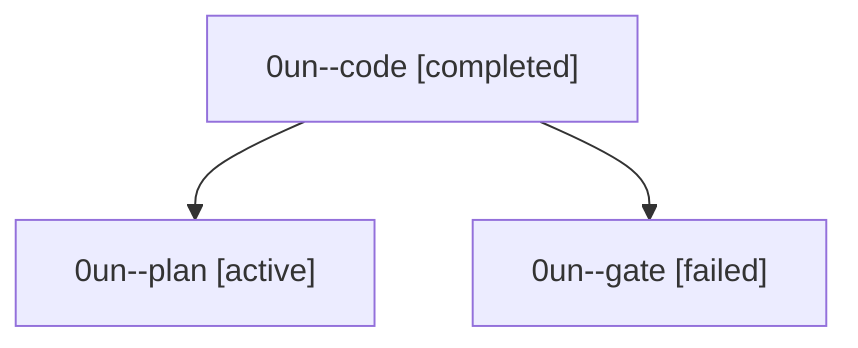

# Session: 0un

[Agent Hoods](../README.md) / [bbugyi200](../users/bbugyi200/README.md) / [athena](../users/bbugyi200/machines/athena/README.md) / [0un](../users/bbugyi200/machines/athena/hoods/0un/README.md) / 0un

Owner: `bbugyi200.athena` · Hood: `0un` · Members: 3

## Lineage

The diagram is an optional enhancement; the ordered table below contains the same lineage in accessible text.

| Role | Agent | State | Model / provider | Timing | Commits | Prompt | Chat |
|---|---|---|---|---|---:|---|---|
| code | 0un--code | completed | muse-spark-1.3-contributor / muse | 2026-10-01T03:59:51.075777+00:00 → 2026-10-01T04:22:01.933124+00:00 | 0 | — | [Chat](../agents/bbugyi200.athena.0un--code/chat.md) |
| plan | 0un--plan | active | gpt-6-astra / codex | 2026-10-01T03:53:39.892143+00:00 | 0 | [Prompt](../agents/bbugyi200.athena.0un--plan/prompt.md) | [Chat](../agents/bbugyi200.athena.0un--plan/chat.md) |
| gate | 0un--gate | failed | gpt-6-astra / codex | 2026-10-01T03:59:09.856858+00:00 → 2026-10-01T03:59:36.387526+00:00 | 0 | — | [Chat](../agents/bbugyi200.athena.0un--gate/chat.md) |

## Neighbors

| Agent | Relation | State |
|---|---|---|
| [0un.w0](bbugyi200.athena.0un.w0.md) (session · 3) | descendant | active 1, completed 1, failed 1 |
