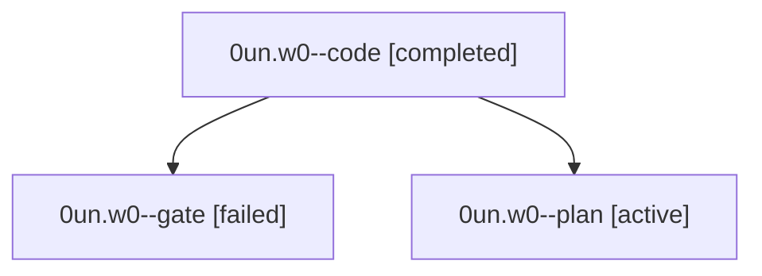

# Session: 0un.w0

[Agent Hoods](../README.md) / [bbugyi200](../users/bbugyi200/README.md) / [athena](../users/bbugyi200/machines/athena/README.md) / [0un](../users/bbugyi200/machines/athena/hoods/0un/README.md) / 0un.w0

Owner: `bbugyi200.athena` · Hood: `0un` · Members: 3

## Lineage

The diagram is an optional enhancement; the ordered table below contains the same lineage in accessible text.

| Role | Agent | State | Model / provider | Timing | Commits | Prompt | Chat |
|---|---|---|---|---|---:|---|---|
| code | 0un.w0--code | completed | muse-spark-1.3-contributor / muse | 2026-10-01T04:35:21.572362+00:00 → 2026-10-01T05:35:51.698985+00:00 | [1](../agents/bbugyi200.athena.0un.w0--code/README.md#commits) | — | [Chat](../agents/bbugyi200.athena.0un.w0--code/chat.md) |
| gate | 0un.w0--gate | failed | gpt-6-astra / codex | 2026-10-01T04:34:16.764295+00:00 → 2026-10-01T04:35:12.792232+00:00 | 0 | — | [Chat](../agents/bbugyi200.athena.0un.w0--gate/chat.md) |
| plan | 0un.w0--plan | active | gpt-6-astra / codex | 2026-10-01T04:26:34.507545+00:00 | 0 | [Prompt](../agents/bbugyi200.athena.0un.w0--plan/prompt.md) | [Chat](../agents/bbugyi200.athena.0un.w0--plan/chat.md) |

## Commits

| Role | Repo | Commit | Subject | Committed |
|---|---|---|---|---|
| code | bob-cli | [`3dd833f`](https://github.com/bobs-org/bob-cli/commit/3dd833fd6a2744e7529b74f1a5cf008fab53434a) | feat(capture): park worked pomodoro links with star selection | 2026-10-01 01:34:28 EDT |

## Neighbors

| Agent | Relation | State |
|---|---|---|
| [0un](bbugyi200.athena.0un.md) (session · 3) | ancestor | active 1, completed 1, failed 1 |
