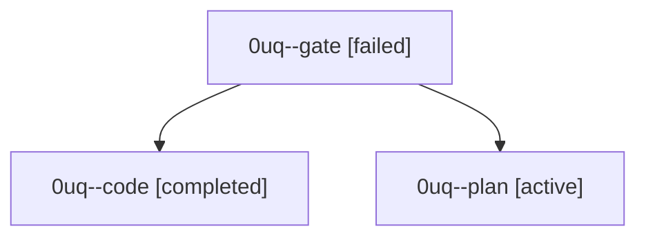

# Session: 0uq

[Agent Hoods](../README.md) / [bbugyi200](../users/bbugyi200/README.md) / [athena](../users/bbugyi200/machines/athena/README.md) / [0uq](../users/bbugyi200/machines/athena/hoods/0uq/README.md) / 0uq

Owner: `bbugyi200.athena` · Hood: `0uq` · Members: 3

## Lineage

The diagram is an optional enhancement; the ordered table below contains the same lineage in accessible text.

| Role | Agent | State | Model / provider | Timing | Commits | Prompt | Chat |
|---|---|---|---|---|---:|---|---|
| gate | 0uq--gate | failed | gpt-6.1-sol / codex | 2026-10-01T06:26:29.352427+00:00 → 2026-10-01T06:26:59.990672+00:00 | 0 | — | [Chat](../agents/bbugyi200.athena.0uq--gate/chat.md) |
| code | 0uq--code | completed | muse-spark-1.3-contributor / muse | 2026-10-01T06:27:17.921022+00:00 → 2026-10-01T06:51:26.901550+00:00 | [1](../agents/bbugyi200.athena.0uq--code/README.md#commits) | — | [Chat](../agents/bbugyi200.athena.0uq--code/chat.md) |
| plan | 0uq--plan | active | gpt-6.1-sol / codex | 2026-10-01T06:12:59.960711+00:00 | 0 | [Prompt](../agents/bbugyi200.athena.0uq--plan/prompt.md) | [Chat](../agents/bbugyi200.athena.0uq--plan/chat.md) |

## Commits

| Role | Repo | Commit | Subject | Committed |
|---|---|---|---|---|
| code | bob-cli | [`8957f4a`](https://github.com/bobs-org/bob-cli/commit/8957f4a7720291ce4f7ef53e53e06611a5edf382) | feat(plan): add max\_ready soft cap for READY backlog (default 100) | 2026-10-01 02:49:42 EDT |
