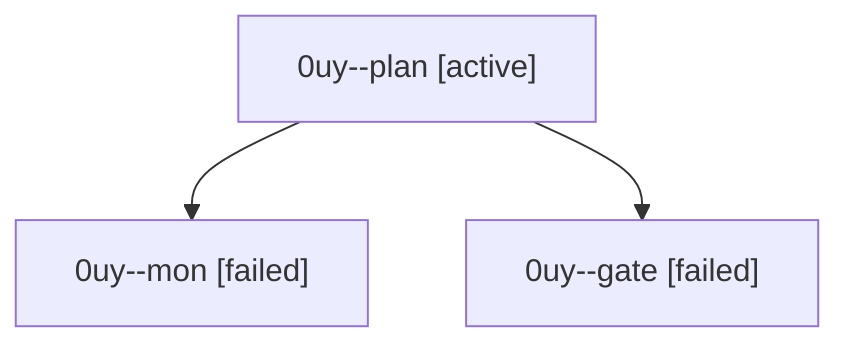

# Session: 0uy

[Agent Hoods](../README.md) / [bbugyi200](../users/bbugyi200/README.md) / [athena](../users/bbugyi200/machines/athena/README.md) / [0uy](../users/bbugyi200/machines/athena/hoods/0uy/README.md) / 0uy

Owner: `bbugyi200.athena` · Hood: `0uy` · Members: 3

## Lineage

The diagram is an optional enhancement; the ordered table below contains the same lineage in accessible text.

| Role | Agent | State | Model / provider | Timing | Commits | Prompt | Chat |
|---|---|---|---|---|---:|---|---|
| plan | 0uy--plan | active | gpt-6-astra / codex | 2026-10-01T17:00:54.093958+00:00 | 0 | [Prompt](../agents/bbugyi200.athena.0uy--plan/prompt.md) | [Chat](../agents/bbugyi200.athena.0uy--plan/chat.md) |
| mon | 0uy--mon | failed | gpt-6-astra / codex | 2026-10-01T17:09:32.757741+00:00 → 2026-10-01T17:11:22.368189+00:00 | 0 | — | [Chat](../agents/bbugyi200.athena.0uy--mon/chat.md) |
| gate | 0uy--gate | failed | gpt-6-astra / codex | 2026-10-01T17:09:14.523487+00:00 → 2026-10-01T17:09:33.581036+00:00 | 0 | — | [Chat](../agents/bbugyi200.athena.0uy--gate/chat.md) |
